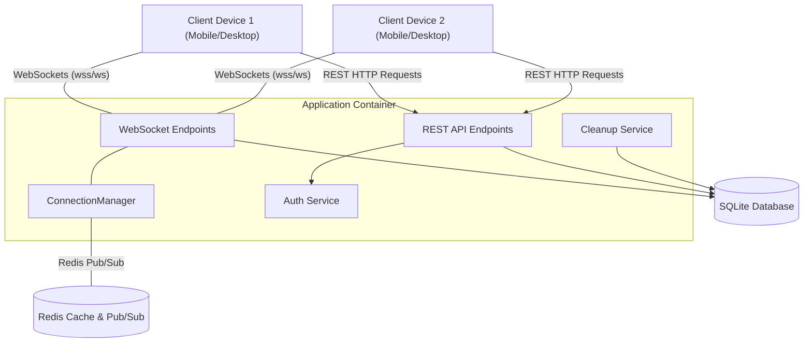
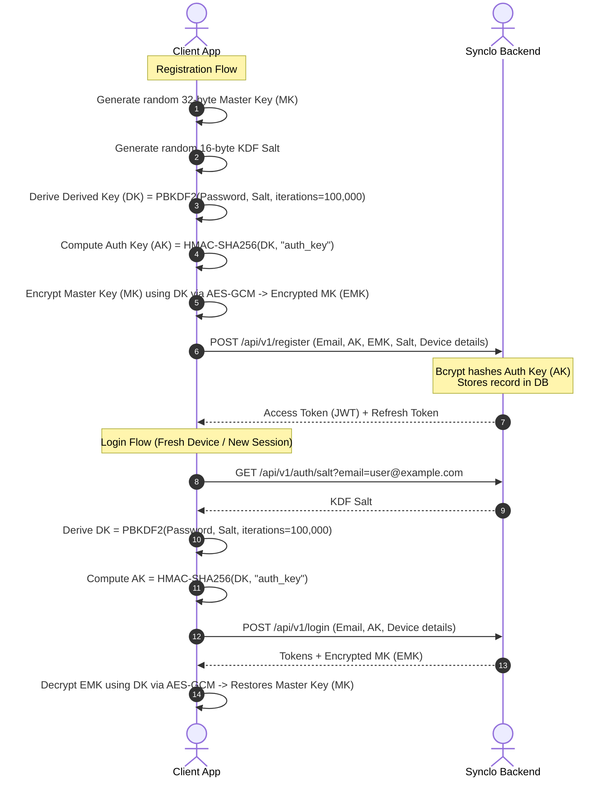
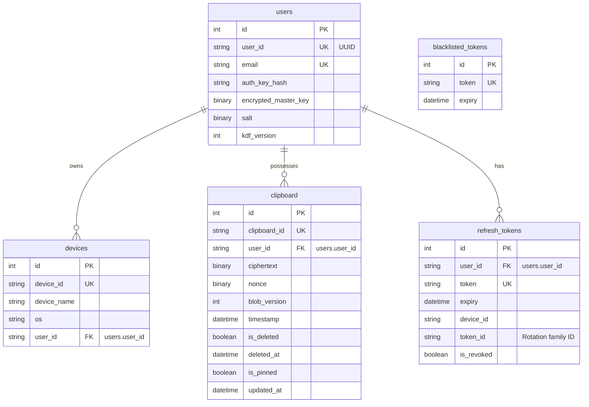

# Synclo Backend Architecture & Protocol Reference (ARCHITECTURE.md)

This document provides a comprehensive overview of the Synclo Backend architecture and client-side integration protocol. It details the high-level system design, Zero-Knowledge cryptographic flows, real-time WebSocket messaging schemas, detailed REST API request/response specifications, and a file-by-file codebase guide.

---

## 1. High-Level System Architecture

Synclo is a real-time, secure, end-to-end encrypted clipboard synchronization service designed around a **Zero-Knowledge Architecture**. The backend server serves as a mediator and encrypted storage engine, never learning the user's password, data decryption keys, or plaintext clipboard payloads.

### Architecture Diagram



*   **REST HTTP Endpoints:** Handle authentication, session tokens, device registrations, and fallback manual clipboard transfers.
*   **WebSocket Endpoints:** Maintain persistent connections for low-latency, real-time clipboard sync.
*   **ConnectionManager:** Coordinates WebSocket sessions. Uses Redis Pub/Sub underneath to distribute sync events across horizontally scaled server instances.
*   **Database (SQLite):** Stores user login hashes, device registries, session tokens, and encrypted clipboard entry history (tombstones).
*   **Cleanup Service:** Background workers running periodic purges on old expired data and tombstones.

---

## 2. Zero-Knowledge Cryptography & Authentication Flow

The server does not know or store raw passwords or master decryption keys. All encryption and decryption happen client-side.

### Cryptographic Invariants

| Key / Parameter | Origin | Server Knowledge | Purpose | Recommended Algorithm |
| :--- | :--- | :--- | :--- | :--- |
| **KDF Salt** | Client (on Reg) | Plaintext (stored) | Used to derive client-side keys | CSPRNG 16 bytes (base64) |
| **Master Key (MK)** | Client (on Reg) | None (never sent) | Encrypts local clipboard payload | CSPRNG 32 bytes (base64) |
| **Derived Key (DK)** | Client (computed) | None (never sent) | Encrypts Master Key locally | PBKDF2-HMAC-SHA256 or Argon2id |
| **Auth Key (AK)** | Client (computed) | Bcrypt Hash only | Authenticates API requests | HMAC-SHA256 of DK |
| **Encrypted MK** | Client (computed) | Ciphertext (stored) | Restores Master Key after login | AES-256-GCM of MK using DK |
| **Clipboard Cipher** | Client (computed) | Ciphertext (stored) | Protects clipboard content | AES-256-GCM of payload using MK |

---

### Sequence Diagram



#### A. Initial Registration
1.  **Generate Local Secret Elements:** Generate a 256-bit `Master Key` and a random 128-bit `Salt` client-side.
2.  **Key Derivation:** Derive a 256-bit `Derived Key` via PBKDF2-HMAC-SHA256 (100,000 iterations). Compute the `Auth Key` by taking the HMAC-SHA256 of the `Derived Key`:
    $$\text{Auth Key} = \text{HMAC-SHA256}(\text{Derived Key}, \text{"auth\\_key"})$$
3.  **Local Wrapping:** Encrypt the `Master Key` using the `Derived Key` via **AES-256-GCM** to output the `Encrypted Master Key`.
4.  **Transmission:** Submit the base64-encoded `Auth Key`, `Encrypted Master Key`, `Salt`, KDF version, and device data to `POST /api/v1/register`.

#### B. Logging In
1.  **Retrieve Salt:** Query `GET /api/v1/auth/salt?email=<email>` to fetch the KDF Salt.
2.  **Derivation:** Recompute the `Derived Key` and `Auth Key` using the password and salt.
3.  **Authentication:** Send the base64-encoded `Auth Key` to `POST /api/v1/login` alongside device identifiers.
4.  **Restore Session:** The login response yields the JWT session tokens and the stored `Encrypted Master Key`. Decrypt the `Encrypted Master Key` using the computed `Derived Key` via AES-256-GCM to restore the plaintext `Master Key` in the client's memory.

#### C. Password Changing (Master Key Re-wrapping)
1.  Derive the current `Derived Key` and `Auth Key` from the old password.
2.  Generate a new random `Salt`.
3.  Derive the **new** `Derived Key` and **new** `Auth Key` using the new password and salt.
4.  Re-encrypt (re-wrap) the raw `Master Key` (which remains unchanged to preserve existing database history) using the **new** `Derived Key` to create a **new** `Encrypted Master Key`.
5.  Send the old and new key material to `POST /api/v1/password/change`.

> [!WARNING]
> Do not change the `Master Key` during a password change. Doing so will invalidate all existing clipboard history stored in the database, making it impossible to decrypt them. Only re-wrap the existing Master Key using the new Derived Key.

---

## 3. Data Synchronization & Tombstone Pattern

To synchronize deletions to offline clients, Synclo uses a soft-deletion pattern:
- **Tombstones:** Deleted clipboard items are not purged immediately. They are marked `is_deleted = True` and given a `deleted_at` server timestamp.
- **Delta Sync:** Offline clients query `/api/v1/clipboard/sync` using a `since` timestamp parameter. The server returns all clipboard updates (inserts, modifications, and tombstones) where `updated_at > since`.
- **Pin System:** Active clipboard entries can be pinned (`is_pinned = True`), keeping them synchronized across devices. Pinned entries are bypassed and preserved during a bulk delete request (`DELETE /api/v1/clipboard`). They are only soft-deleted when targeted specifically (`DELETE /api/v1/clipboard/{id}`), which automatically sets `is_pinned = False`.
- **Retention Cleanup:** A background thread running every 24 hours purges tombstones older than `TOMBSTONE_RETENTION_DAYS` (default: 30 days) to prevent database bloating.
- **Expired Sync Prevention:** If a client requests a delta sync with a `since` timestamp older than the 30-day retention cutoff, the server rejects it with `410 Gone`. The client is forced to wipe its local database and perform a fresh full sync.

---

## 4. WebSocket Protocol (Real-time Synchronization)

The WebSocket endpoint provides push-based real-time clipboard synchronization across all authorized active devices.

*   **Endpoint:** `ws://<HOST>/ws/v1/sync` (local) or `wss://<HOST>/ws/v1/sync` (production)
*   **Protocol Handshake:** Must include the header: `Authorization: Bearer <access_token>`.

### Message Protocols (JSON Frames)

#### A. Clipboard Data Push (Client ➔ Server)
When the client copies a text, it encrypts the data using the `Master Key` (AES-256-GCM), encoding both cipher text and IV as base64, and sends:
```json
{
  "id": "c1f77d33-bc42-4916-b847-ec4b868e4bf9",
  "timestamp": "2026-06-14T14:15:30.123Z",
  "ciphertext": "dGhpcyBpcyBzZWNyZXQ...",
  "nonce": "YTM4OTJkOWM...",
  "blob_version": 1,
  "is_deleted": false,
  "is_pinned": false
}
```

#### B. Clipboard Deletion Broadcast (Client ➔ Server)
If a client soft-deletes a clipboard entry:
```json
{
  "id": "c1f77d33-bc42-4916-b847-ec4b868e4bf9",
  "timestamp": "2026-06-14T14:18:00.000Z",
  "is_deleted": true
}
```
*   `ciphertext` and `nonce` must be omitted or sent as `null` to ensure immediate server data purging (tombstoning).

#### C. Server Acknowledgment (Server ➔ Client)
Sent after the database write succeeds:
```json
{
  "type": "ack",
  "id": "c1f77d33-bc42-4916-b847-ec4b868e4bf9"
}
```

#### D. Server Broadcast Update (Server ➔ Other Clients)
Broadcasts incoming changes/tombstones to other devices. For deletions:
```json
{
  "id": "c1f77d33-bc42-4916-b847-ec4b868e4bf9",
  "timestamp": "2026-06-14T14:18:00.000Z",
  "ciphertext": null,
  "nonce": null,
  "blob_version": 1,
  "is_deleted": true,
  "is_pinned": false
}
```

#### E. Heartbeat (Ping/Pong)
*   The server automatically pings if no frames are received for **45 seconds**: `{"type": "ping"}`
*   The client must reply within **10 seconds** with: `{"type": "pong"}`

#### F. Server Force Close Notification
If a device is deleted by another device via REST APIs:
1.  Server sends JSON frame: `{"type": "device_deleted", "message": "This device has been removed from your account"}`
2.  Server immediately closes connection with code `4003`.

#### G. Device Added Notification (Server ➔ Other Clients)
Pushed to other connected user devices when a new device is registered:
```json
{
  "type": "device_added",
  "device": {
    "device_id": "unique_device_id_string",
    "device_name": "My iPhone 15",
    "os": "iOS"
  }
}
```

#### H. Device Updated Notification (Server ➔ Other Clients)
Pushed to other connected user devices when an existing device updates its metadata (e.g. OS version during login):
```json
{
  "type": "device_updated",
  "device": {
    "device_id": "unique_device_id_string",
    "device_name": "My iPhone 15",
    "os": "iOS"
  }
}
```

### WebSocket Close Status Codes

*   `1000`: Normal closure.
*   `1008`: Policy Violation / Auth Failed. Token invalid or blacklisted. Prompt re-login.
*   `4001`: Token Expired. Perform token refresh and reconnect.
*   `4002`: Ping/Pong Timeout. Reconnect (possible network drop).
*   `4003`: Device Deleted Remotely. Clear local state, logout user, redirect to login.
*   `1011`: Internal Server Error. Reconnect with exponential backoff.

---

## 5. REST API Reference

All protected API endpoints require an Authorization Header: `Authorization: Bearer <access_token>`.

### Authentication Endpoints

#### `GET /api/v1/auth/salt`
Retrieves KDF parameters to begin key derivation for login.
*   **Query Parameters:**
    *   `email` (string, required): The user's email address.
*   **Response (200 OK):**
    ```json
    {
      "salt": "dGhpcyBpcyBzYWx0...",
      "kdf_version": 1
    }
    ```
*   **Errors:**
    *   `404 Not Found`: Email not found (prevents email enumeration).
    *   `429 Too Many Requests`: Rate limit exceeded.

---

#### `POST /api/v1/register`
Registers a new user and registers the first device (Async).
> [!NOTE]
> On successful user and device registration, the server broadcasts a `"device_added"` event over WebSockets to any other connected devices for this user.
*   **Request Body:**
    ```json
    {
      "email": "user@example.com",
      "auth_key": "base64_encoded_client_derived_auth_key",
      "device_id": "unique_device_id_string",
      "device_name": "My iPhone 15",
      "os": "iOS",
      "encrypted_master_key": "base64_encoded_wrapped_key",
      "salt": "base64_encoded_salt",
      "kdf_version": 1
    }
    ```
*   **Response (200 OK):**
    ```json
    {
      "access_token": "eyJhbGciOi...",
      "refresh_token": "plain_refresh_token_string",
      "token_type": "bearer"
    }
    ```
*   **Errors:**
    *   `400 Bad Request`: Validation failure (lengths out of bounds).
    *   `409 Conflict`: Email or Device ID already registered.

---

#### `POST /api/v1/login`
Logs in a user and registers/updates the device connection (Async).
> [!NOTE]
> * If a new device is auto-registered during login, a `"device_added"` event is broadcasted.
> * If an existing device updates its OS version during login, a `"device_updated"` event is broadcasted.
*   **Request Body:**
    ```json
    {
      "email": "user@example.com",
      "auth_key": "base64_encoded_client_derived_auth_key",
      "device_id": "unique_device_id_string",
      "device_name": "My iPhone 15",
      "os": "iOS"
    }
    ```
*   **Response (200 OK):**
    ```json
    {
      "access_token": "eyJhbGciOi...",
      "refresh_token": "plain_refresh_token_string",
      "token_type": "bearer",
      "email": "user@example.com",
      "encrypted_master_key": "base64_encoded_wrapped_key",
      "salt": "base64_encoded_salt",
      "kdf_version": 1
    }
    ```
*   **Errors:**
    *   `401 Unauthorized`: Invalid credentials.
    *   `403 Forbidden`: Device ID belongs to another user.

---

#### `POST /api/v1/logout`
Logs out the current device and blacklists the current access token.
*   **Headers:** `Authorization: Bearer <access_token>`
*   **Request Body:**
    ```json
    {
      "refresh_token": "plain_refresh_token_string"
    }
    ```
*   **Response (200 OK):**
    ```json
    {
      "message": "Logged out successfully"
    }
    ```

---

#### `POST /api/v1/refresh`
Obtains a new Access/Refresh token pair using Refresh Token Rotation (RTR).
*   **Request Body:**
    ```json
    {
      "refresh_token": "plain_refresh_token_string"
    }
    ```
*   **Response (200 OK):**
    ```json
    {
      "access_token": "eyJhbGciOi...",
      "refresh_token": "new_plain_refresh_token_string",
      "token_type": "bearer"
    }
    ```
*   **Errors:**
    *   `401 Unauthorized`: Token expired, token invalid, or token reuse detected (triggers immediate revocation of the entire session family).

---

#### `POST /api/v1/password/change`
Changes the user password and updates the wrapped master key.
*   **Headers:** `Authorization: Bearer <access_token>`
*   **Request Body:**
    ```json
    {
      "old_auth_key": "base64_encoded_old_auth_key",
      "new_auth_key": "base64_encoded_new_auth_key",
      "new_encrypted_master_key": "base64_encoded_rewrapped_key",
      "new_salt": "base64_encoded_new_salt",
      "new_kdf_version": 1
    }
    ```
*   **Response (200 OK):**
    ```json
    {
      "message": "Password changed successfully. Master key re-wrapped."
    }
    ```
*   **Errors:**
    *   `401 Unauthorized`: Incorrect old auth key.

---

#### `DELETE /api/v1/delete`
Permanently deletes the user account, all device records, and all clipboard history.
*   **Headers:** `Authorization: Bearer <access_token>`
*   **Response (200 OK):**
    ```json
    {
      "message": "Your account and all associated data have been deleted."
    }
    ```

---

### Device Management Endpoints

#### `POST /api/v1/devices/register`
Manually adds a new device connection to the user account (Async).
> [!NOTE]
> On successful registration, the server broadcasts a `"device_added"` event over WebSockets to any other connected devices for this user.
*   **Headers:** `Authorization: Bearer <access_token>`
*   **Request Body:**
    ```json
    {
      "device_id": "unique_device_id_string",
      "device_name": "My iPad Pro",
      "os": "iPadOS"
    }
    ```
*   **Response (200 OK):**
    ```json
    {
      "device_id": "unique_device_id_string",
      "device_name": "My iPad Pro",
      "os": "iPadOS"
    }
    ```
*   **Errors:**
    *   `403 Forbidden`: Device ID belongs to another user.

---

#### `GET /api/v1/devices`
Lists all active devices linked to the user account.
*   **Headers:** `Authorization: Bearer <access_token>`
*   **Response (200 OK):**
    ```json
    [
      {
        "device_id": "unique_device_id_string",
        "device_name": "My iPad Pro",
        "os": "iPadOS"
      }
    ]
    ```

---

#### `DELETE /api/v1/devices/{device_id}`
Removes a device, revokes its session tokens, and disconnects its active WebSocket.
*   **Headers:** `Authorization: Bearer <access_token>`
*   **Response (200 OK):**
    ```json
    {
      "message": "Device 'My iPad Pro' deleted successfully"
    }
    ```
*   **Errors:**
    *   `404 Not Found`: Device not found under this user account.

---

### Clipboard Endpoints

#### `POST /api/v1/clipboard`
Synchronizes or updates a clipboard item manually via REST.
*   **Headers:** `Authorization: Bearer <access_token>`
*   **Request Body:**
    ```json
    {
      "id": "c1f77d33-bc42-4916-b847-ec4b868e4bf9",
      "ciphertext": "base64_encoded_ciphertext",
      "nonce": "base64_encoded_nonce",
      "blob_version": 1,
      "timestamp": "2026-06-14T14:15:30Z",
      "is_pinned": false
    }
    ```
*   **Response (200 OK):**
    ```json
    {
      "status": "clipboard synced",
      "id": "c1f77d33-bc42-4916-b847-ec4b868e4bf9"
    }
    ```

---

#### `GET /api/v1/clipboard`
Fetches the latest active clipboard entry.
*   **Headers:** `Authorization: Bearer <access_token>`
*   **Response (200 OK):**
    ```json
    {
      "id": "c1f77d33-bc42-4916-b847-ec4b868e4bf9",
      "ciphertext": "base64_encoded_ciphertext",
      "nonce": "base64_encoded_nonce",
      "blob_version": 1,
      "timestamp": "2026-06-14T14:15:30Z",
      "updated_at": "2026-06-14T14:15:31Z",
      "is_deleted": false,
      "deleted_at": null,
      "is_pinned": false
    }
    ```
*   **Errors:**
    *   `404 Not Found`: No clipboard entries found.

---

#### `GET /api/v1/clipboard/all`
Debug endpoint to retrieve all clipboard items.
*   **Headers:** `Authorization: Bearer <access_token>`
*   **Query Parameters:**
*   `include_deleted` (boolean, optional, default: `false`): Include deleted tombstones in response.
*   **Response (200 OK):**
    ```json
    [
      {
        "id": "c1f77d33-bc42-4916-b847-ec4b868e4bf9",
        "ciphertext": "base64_encoded_ciphertext",
        "nonce": "base64_encoded_nonce",
        "blob_version": 1,
        "timestamp": "2026-06-14T14:15:30Z",
        "updated_at": "2026-06-14T14:15:31Z",
        "is_deleted": false,
        "deleted_at": null,
        "is_pinned": false
      }
    ]
    ```

---

#### `GET /api/v1/clipboard/sync`
Delta sync endpoint for clients coming online to download changes.
*   **Headers:** `Authorization: Bearer <access_token>`
*   **Query Parameters:**
    *   `since` (ISO 8601 string, optional): Fetch updates modified after this server-time.
    *   `limit` (integer, optional, default: 1000): Pagination limit.
    *   `offset` (integer, optional, default: 0): Pagination offset.
*   **Response (200 OK):**
    ```json
    {
      "entries": [
        {
          "id": "c1f77d33-bc42-4916-b847-ec4b868e4bf9",
          "ciphertext": null,
          "nonce": null,
          "blob_version": 1,
          "timestamp": "2026-06-14T14:15:30Z",
          "updated_at": "2026-06-14T14:18:01Z",
          "is_deleted": true,
          "deleted_at": "2026-06-14T14:18:00Z",
          "is_pinned": false
        }
      ],
      "next_offset": 1,
      "has_more": false,
      "total_count": 1
    }
    ```
*   **Errors:**
    *   `410 Gone`: Triggered if the `since` timestamp is older than the `TOMBSTONE_RETENTION_DAYS` (30 days). The client must wipe its local cache and perform a full sync.

---

#### `DELETE /api/v1/clipboard/{clipboard_id}`
Soft-deletes a single clipboard item (Idempotent).
*   **Headers:** `Authorization: Bearer <access_token>`
*   **Response (200 OK):**
    ```json
    {
      "message": "Clipboard entry deleted"
    }
    ```

---

#### `DELETE /api/v1/clipboard`
Soft-deletes all currently active, unpinned clipboard entries (history clearing). Pinned entries are preserved and skipped.
*   **Headers:** `Authorization: Bearer <access_token>`
*   **Response (200 OK):**
    ```json
    {
      "message": "15 clipboard entries deleted."
    }
    ```
    *(Returns `{"message": "No clipboard entries to delete."}` if history is already empty or only contains pinned items)*

---

#### `GET /health`
Public health status check.
*   **Response (200 OK):**
    ```json
    {
      "status": "ok"
    }
    ```

---

### Rate Limiting & API Safety

To protect the server from abuse, rate limits are applied to sensitive endpoints (e.g., registrations, logins, clipboard writes) using the `FastAPILimiter` middleware.

#### Expected Behavior on Limit Exceeded
When a client exceeds the request limit (typically 5 to 30 requests per minute depending on the endpoint), the server responds with:
*   **HTTP Status:** `429 Too Many Requests`
*   **Response Body (JSON):**
    ```json
    {
      "detail": "Rate limit exceeded"
    }
    ```

**Client Integration Best Practice:** Clients should implement a token bucket strategy or exponential backoff with jitter when encountering `429` statuses to avoid request thrashing and network bans.

---

## 6. Codebase Structure (File-by-File Analysis)

### Core Setup & Configurations (`app/core/`)

#### [config.py](file:///E:/Files/Code-Stuff/Projects/Synclo-Backend/app/core/config.py)
Loads environment configurations from `.env` files into a static `Settings` class. It performs startup security assertions, validating keys such as `SECRET_KEY` and HMAC keys.

#### [constants.py](file:///E:/Files/Code-Stuff/Projects/Synclo-Backend/app/core/constants.py)
Defines project-wide size constraints (e.g. max ciphertext length of 64KB, salt lengths) and lists valid protocol and KDF versions.

#### [database.py](file:///E:/Files/Code-Stuff/Projects/Synclo-Backend/app/core/database.py)
Configures the SQLAlchemy engine and SQLite session pool, defining database connection options.

#### [logging_config.py](file:///E:/Files/Code-Stuff/Projects/Synclo-Backend/app/core/logging_config.py)
Initializes stdout stream loggers and rotating file log handlers writing logs to the `/app/logs/` folder.

---

### Database Models & Schemas

#### [models.py](file:///E:/Files/Code-Stuff/Projects/Synclo-Backend/app/models/models.py)
Declares database entities mapping users, devices, refresh tokens, blacklisted tokens, and clipboard tables.

#### [schemas.py](file:///E:/Files/Code-Stuff/Projects/Synclo-Backend/app/schemas/schemas.py)
Defines Pydantic v2 schemas used to filter and validate request JSON bodies and serialize responses.

---

### Core Business Logic (`app/services/`)

#### [auth.py](file:///E:/Files/Code-Stuff/Projects/Synclo-Backend/app/services/auth.py)
Coordinates JWT token encoding/decoding, password validation, and request authentication dependencies (`get_current_user`).

#### [crypto_utils.py](file:///E:/Files/Code-Stuff/Projects/Synclo-Backend/app/services/crypto_utils.py)
Calculates HMAC-SHA256 hashes of refresh tokens to secure database storage against key leakage.

#### [serializers.py](file:///E:/Files/Code-Stuff/Projects/Synclo-Backend/app/services/serializers.py)
Converts raw database byte fields (e.g., binary ciphertext, salt blobs) into base64-encoded strings for JSON serializations.

#### [utils.py](file:///E:/Files/Code-Stuff/Projects/Synclo-Backend/app/services/utils.py)
Defines scheduled database housekeeping routines: clearing revoked tokens, expired refresh sessions, and old tombstone entries.

---

### API Routers & Endpoints (`app/endpoints/`)

#### [auth_endpoints.py](file:///E:/Files/Code-Stuff/Projects/Synclo-Backend/app/endpoints/auth_endpoints.py)
Processes accounts, sessions, password changes, token rotations, logouts, and user deletions.

#### [device_endpoints.py](file:///E:/Files/Code-Stuff/Projects/Synclo-Backend/app/endpoints/device_endpoints.py)
Manages device list registries and remote device exclusions.

#### [clipboard_endpoints.py](file:///E:/Files/Code-Stuff/Projects/Synclo-Backend/app/endpoints/clipboard_endpoints.py)
Manages manual HTTP clipboard operations, delta updates, history clears, and deletes.

#### [websocket_endpoints.py](file:///E:/Files/Code-Stuff/Projects/Synclo-Backend/app/endpoints/websocket_endpoints.py)
Handles client WebSocket upgrades, handles heartbeat protocols, receives writes/deletes, processes database saves asynchronously via `asyncio.to_thread` pools, and broadcasts updates.

---

### WebSocket Connection Management

#### [connection_manager.py](file:///E:/Files/Code-Stuff/Projects/Synclo-Backend/app/websockets/connection_manager.py)
Monitors connection sockets in a thread-safe nested dictionary. Integrates Redis Pub/Sub channels to distribute broadcasts across clustered deployment nodes.

---

### Application Entry Point

#### [main.py](file:///E:/Files/Code-Stuff/Projects/Synclo-Backend/app/main.py)
Initializes the FastAPI application instance. Configures automatic migrations (`alembic upgrade head`), configures Redis connection pools, initializes rate limits, starts the 24h periodic cleanup loop, and sets up global exception handlers.

## 7. Database Schema Reference

Synclo uses SQLite as its primary database. The schema is optimized for E2EE payloads, real-time device tracking, and delta-based synchronizations. Below is a detailed view of the tables and their relations:



### Table Definitions

#### A. `users` Table
*   **`id`** (`Integer`, PK, Auto-increment): Database-internal primary identifier.
*   **`user_id`** (`String`, Unique, Index, Not Null): Public UUID string used as the primary identifier for database relationships and logs.
*   **`email`** (`String`, Unique, Index, Not Null): The user's registered email address.
*   **`auth_key_hash`** (`String`, Not Null): Bcrypt hash of the HKDF client-derived auth key.
*   **`encrypted_master_key`** (`LargeBinary`, Not Null): Client-wrapped master decryption key (AES-256-GCM encrypted).
*   **`salt`** (`LargeBinary`, Not Null): 16-byte KDF salt used during password hashing.
*   **`kdf_version`** (`Integer`, Not Null, Default `1`): Argon2/PBKDF2 settings version.

#### B. `devices` Table
*   **`id`** (`Integer`, PK, Auto-increment): Database-internal primary identifier.
*   **`device_id`** (`String`, Unique, Index, Not Null): Client-generated unique device string.
*   **`device_name`** (`String`): Friendly name assigned to the device.
*   **`os`** (`String`, Nullable): Device OS metadata.
*   **`user_id`** (`String`, FK, Index): References `users.user_id` (UUID).

#### C. `clipboard` Table
*   **`id`** (`Integer`, PK, Auto-increment): Database-internal primary key (renamed from `index`).
*   **`clipboard_id`** (`String`, Unique, Index, Not Null): Client-generated item UUID (renamed from `id`).
*   **`user_id`** (`String`, FK): References `users.user_id` (UUID).
*   **`ciphertext`** (`LargeBinary`, Nullable): Encrypted clipboard content (purged/null when soft-deleted).
*   **`nonce`** (`LargeBinary`, Nullable): AES-GCM IV (purged/null when soft-deleted).
*   **`blob_version`** (`Integer`, Not Null, Default `1`): Encrypted payload structural schema version.
*   **`timestamp`** (`DateTime`): Client-side copying event timestamp.
*   **`is_deleted`** (`Boolean`, Index): Indicates if the item is a soft-deleted tombstone.
*   **`deleted_at`** (`DateTime`, Index, Nullable): Server timestamp of soft-deletion.
*   **`is_pinned`** (`Boolean`, Index, Not Null, Default `0`): Protects items from bulk clear operations.
*   **`updated_at`** (`DateTime`, Index, Not Null): Server modification time used for offline client delta updates.

#### D. `refresh_tokens` Table
*   **`id`** (`Integer`, PK, Auto-increment): Database-internal primary identifier.
*   **`user_id`** (`String`, FK): References `users.user_id` (UUID).
*   **`token`** (`String`, Unique, Index): HMAC-SHA256 hash of the refresh token string.
*   **`expiry`** (`DateTime`, Index): Expiration timestamp.
*   **`device_id`** (`String`, Not Null): ID of the device associated with this session token.
*   **`token_id`** (`String`, Index, Not Null): Token family ID used for Rotation & Theft Detection (renamed from `family_id`).
*   **`is_revoked`** (`Boolean`, Default `False`): Tracks whether token has already been rotated.

#### E. `blacklisted_tokens` Table
*   **`id`** (`Integer`, PK, Auto-increment): Database-internal primary identifier.
*   **`token`** (`String`, Unique, Not Null): Invalidated access token value.
*   **`expiry`** (`DateTime`, Index, Not Null): Expiration time of token.

---

## 8. Database Schema Migration & Infrastructure

- **[alembic.ini](file:///E:/Files/Code-Stuff/Projects/Synclo-Backend/alembic.ini):** Configures Alembic migration routes.
- **[Dockerfile](file:///E:/Files/Code-Stuff/Projects/Synclo-Backend/Dockerfile):** Builds the standard Docker image using a `python:3.12-slim` base image.
- **[compose.yaml](file:///E:/Files/Code-Stuff/Projects/Synclo-Backend/compose.yaml):** Orchestrates multi-container runs (FastAPI App + Redis alpine instance) mapping storage folders to host paths.
- **[tests/](file:///E:/Files/Code-Stuff/Projects/Synclo-Backend/tests/):** End-to-end integration and mock tests targeting delta sync limits, device creation/revocation, and pagination.
