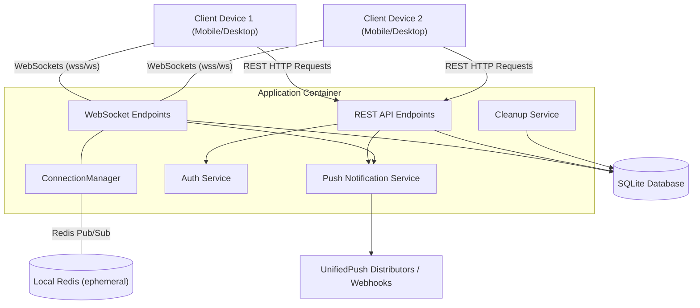
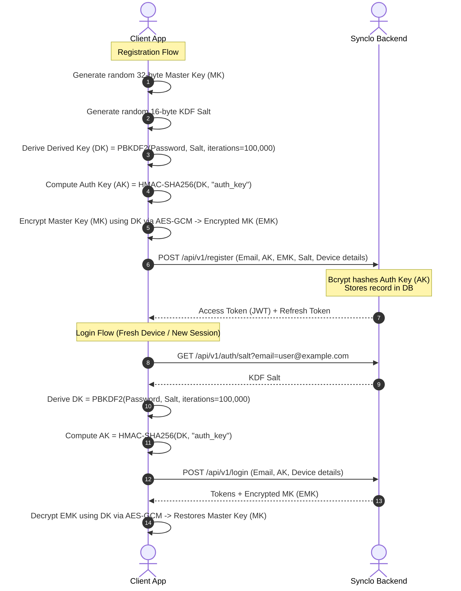
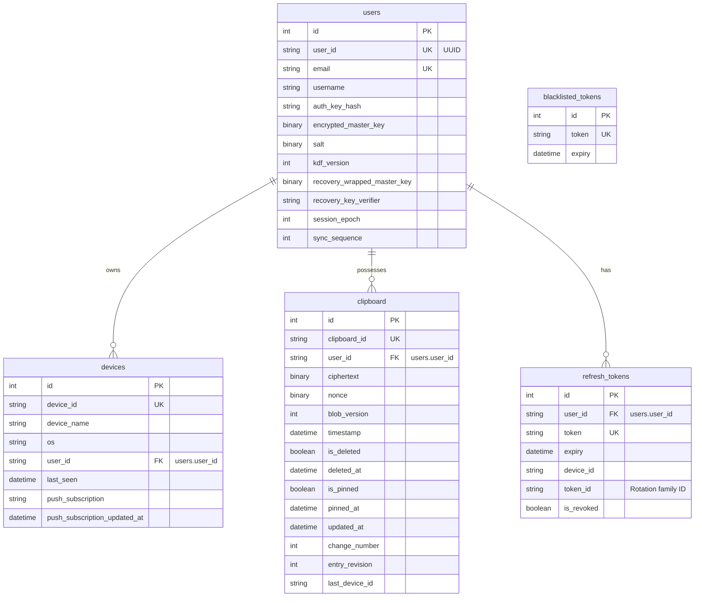

# Synclo Backend Architecture & Protocol Reference (ARCHITECTURE.md)

This document provides a comprehensive overview of the Synclo Backend architecture and client-side integration protocol. It details the high-level system design, Zero-Knowledge cryptographic flows, real-time WebSocket messaging schemas, detailed REST API request/response specifications, and a file-by-file codebase guide.

---

## 1. High-Level System Architecture

Synclo is a real-time, secure, end-to-end encrypted clipboard synchronization service designed around a **Zero-Knowledge Architecture**. The backend server serves as a mediator and encrypted storage engine, never learning the user's password, data decryption keys, or plaintext clipboard payloads.

### Architecture Diagram


```mermaid
graph TD
    Client1["Client Device 1 (Mobile/Desktop)"] ---|"WebSockets (wss/ws)"| WS_End["WebSocket Endpoints"]
    Client2["Client Device 2 (Mobile/Desktop)"] ---|"WebSockets (wss/ws)"| WS_End
    Client1 -->|"REST HTTP Requests"| REST_End["REST API Endpoints"]
    Client2 -->|"REST HTTP Requests"| REST_End
    
    subgraph FastAPI ["Application Container"]
        WS_End
        REST_End
        Manager["ConnectionManager"]
        AuthServ["Auth Service"]
        CleanupServ["Cleanup Service"]
        PushServ["Push Notification Service"]
    end
    
    WS_End --- Manager
    REST_End --> AuthServ
    WS_End --> DB[("SQLite Database")]
    REST_End --> DB
    CleanupServ --> DB
    REST_End --> PushServ
    WS_End --> PushServ
    PushServ --> Dist["UnifiedPush Distributors / Webhooks"]
    
    Manager ---|"Redis Pub/Sub"| Redis[("Local Redis (ephemeral)")]
```

*   **REST HTTP Endpoints:** Handle authentication, session tokens, device registrations, and fallback manual clipboard transfers.
*   **WebSocket Endpoints:** Maintain persistent connections for low-latency, real-time clipboard sync.
*   **ConnectionManager:** Coordinates WebSocket sessions. Uses Redis Pub/Sub to relay sync events between backend worker processes with node-level echo suppression. The backend is designed strictly as a single-node server for VPS / homelab self-hosting without multi-node clustering or distributed overhead.
*   **Redis:** Provides Pub/Sub, distributed rate-limit counters, and the periodic-cleanup lock. It is isolated on the private container bridge network, health-checked, memory-bounded, and intentionally ephemeral; Redis is not a source of durable application data.
*   **Database (SQLite):** Stores user login hashes, device registries, session tokens, and encrypted clipboard entry history (tombstones). Operates in WAL mode with serializable write transactions.
*   **Cleanup Service:** Background workers running periodic purges on old expired data and tombstones.

---

## 2. Zero-Knowledge Cryptography & Authentication Flow

The server does not know or store raw passwords or master decryption keys. All encryption and decryption happen client-side.

### Cryptographic Invariants

| Key / Parameter | Origin | Server Knowledge | Purpose | Recommended Algorithm |
| :--- | :--- | :--- | :--- | :--- |
| **KDF Salt** | Client (on Reg) | Plaintext (stored) | Used to derive client-side keys | CSPRNG 16 bytes (base64) |
| **Master Key (MK)** | Client (on Reg) | None (never sent) | Encrypts local clipboard payload | CSPRNG 32 bytes (base64) |
| **Derived Key (DK)** | Client (computed) | None (never sent) | Encrypts Master Key locally | PBKDF2-HMAC-SHA256 or Argon2id |
| **Auth Key (AK)** | Client (computed) | Bcrypt Hash only | Authenticates API requests | HMAC-SHA256 of DK |
| **Encrypted MK** | Client (computed) | Ciphertext (stored) | Restores Master Key after login | AES-256-GCM of MK using DK |
| **Recovery Key Verifier** | Client (computed) | Bcrypt Hash only | Authenticates account recovery requests | Bcrypt of HKDF(Recovery Key, "recovery_verify") |
| **Recovery Wrapped MK** | Client (computed) | Ciphertext (stored) | Restores Master Key during emergency recovery | AES-256-GCM of MK using HKDF(Recovery Key, "recovery_wrap") |
| **Clipboard Cipher** | Client (computed) | Ciphertext (stored) | Protects clipboard content | AES-256-GCM of payload using MK |

---

### Sequence Diagram


```mermaid
sequenceDiagram
    autonumber
    actor Client as Client App
    actor Server as Synclo Backend
    
    Note over Client: Registration Flow
    Client->>Client: Generate random 32-byte Master Key (MK)
    Client->>Client: Generate random 16-byte KDF Salt
    Client->>Client: Derive Derived Key (DK) = PBKDF2(Password, Salt, iterations=100,000)
    Client->>Client: Compute Auth Key (AK) = HMAC-SHA256(DK, "auth_key")
    Client->>Client: Encrypt Master Key (MK) using DK via AES-GCM -> Encrypted MK (EMK)
    Client->>Server: POST /api/v1/register (Email, AK, EMK, Salt, Device details)
    Note over Server: Bcrypt hashes Auth Key (AK)<br/>Stores record in DB
    Server-->>Client: Access Token (JWT) + Refresh Token
    
    Note over Client: Login Flow (Fresh Device / New Session)
    Client->>Server: GET /api/v1/auth/salt?email=user@example.com
    Server-->>Client: KDF Salt
    Client->>Client: Derive DK = PBKDF2(Password, Salt, iterations=100,000)
    Client->>Client: Compute AK = HMAC-SHA256(DK, "auth_key")
    Client->>Server: POST /api/v1/login (Email, AK, Device details)
    Server-->>Client: Tokens + Encrypted MK (EMK)
    Client->>Client: Decrypt EMK using DK via AES-GCM -> Restores Master Key (MK)
```

#### A. Initial Registration
1.  **Generate Local Secret Elements:** Generate a 256-bit `Master Key` and a random 128-bit `Salt` client-side.
2.  **Key Derivation:** Derive a 256-bit `Derived Key` via PBKDF2-HMAC-SHA256 (100,000 iterations). Compute the `Auth Key` by taking the HMAC-SHA256 of the `Derived Key`:
    ```text
    Auth Key = HMAC-SHA256(Derived Key, "auth_key")
    ```
3.  **Local Wrapping:** Encrypt the `Master Key` using the `Derived Key` via **AES-256-GCM** to output the `Encrypted Master Key`.
4.  **Recovery Kit Generation:** Generate a random 256-bit `Recovery Key` client-side. Derive `K_rec = HKDF(Recovery Key, "recovery_wrap")` to wrap the `Master Key` via AES-256-GCM into `recovery_wrapped_master_key`. Compute the verifier `V_rec = HKDF(Recovery Key, "recovery_verify")` to output `recovery_key_verifier`.
5.  **Transmission:** Submit the base64-encoded `Auth Key`, `Encrypted Master Key`, `Salt`, KDF version, `recovery_wrapped_master_key`, `recovery_key_verifier`, and device data to `POST /api/v1/register`.

#### B. Logging In
1.  **Retrieve Salt:** Query `GET /api/v1/auth/salt?email=<email>` to fetch the KDF Salt.
2.  **Derivation:** Recompute the `Derived Key` and `Auth Key` using the password and salt.
3.  **Authentication:** Send the base64-encoded `Auth Key` to `POST /api/v1/login` alongside device identifiers.
4.  **Restore Session:** The login response yields the JWT session tokens and the stored `Encrypted Master Key`. Decrypt the `Encrypted Master Key` using the computed `Derived Key` via AES-256-GCM to restore the plaintext `Master Key` in the client's memory.

#### C. Password Changing (Master Key Re-wrapping)
1.  Derive the current `Derived Key` and `Auth Key` from the old password.
2.  Generate a new random `Salt`.
3.  Derive the **new** `Derived Key` and **new** `Auth Key` using the new password and salt.
4.  Re-encrypt (re-wrap) the raw `Master Key` (which remains unchanged to preserve existing database history) using the **new** `Derived Key` to create a **new** `Encrypted Master Key`.
5.  Send the old and new key material to `POST /api/v1/password/change`.

> [!WARNING]
> Do not change the `Master Key` during a password change. Doing so will invalidate all existing clipboard history stored in the database, making it impossible to decrypt them. Only re-wrap the existing Master Key using the new Derived Key.

### User Account Observability & Anti-Enumeration Design

In conventional multi-tenant web applications, user enumeration is typically masked using out-of-band communication channels (e.g., asynchronous transactional emails such as *"If an account exists with this email, a reset link has been sent"*). Because **Synclo does not feature an email delivery infrastructure** and operates under a **Zero-Knowledge Architecture**, account existence is observable at ingress boundaries by structural necessity:

1. **Registration Collisions (`POST /register`):** The server must return an immediate `409 Conflict ("Email already registered")`. Without an email system, returning a generic 200 would leave the user permanently stranded without access to the account credentials.
2. **Cryptographic Salt Retrieval (`GET /auth/salt`):** The server returns `404 Not Found ("Email not found")` when an email is unregistered. Providing a synthetic/dummy salt would provide zero real security (attackers could still probe `/register`) while forcing legitimate users who mistype their email to burn client device CPU and battery computing expensive Argon2id hashes locally.
3. **Protection Strategy:** Automated enumeration and dictionary scanning are strictly bounded by Redis-backed per-IP rate limiters (`FastAPILimiter`) across all authentication endpoints (`/register`: 3/min, `/auth/salt`: 10/min, `/login`: 5/min, `/auth/recover`: 3/min).
4. **Credential & Recovery Uniformity:** To prevent secondary side-channel disclosure and provide clean user experiences, authentication and recovery endpoints return uniform error responses:
   - `POST /login`: Uniformly returns `401 Unauthorized ("Invalid credentials")` across missing users, incorrect passwords, and malformed auth keys.
   - `POST /auth/recovery-material` & `POST /auth/recover`: Both uniformly return `401 Unauthorized ("Could not recover account")`.
   - `POST /password/change`: Returns `401 Unauthorized ("Incorrect current password")`.

---

## 3. Data Synchronization & Tombstone Pattern

Synclo implements a deterministic, multi-master synchronization model combining monotonic sequence counters, Last-Write-Wins (LWW) conflict resolution, server-side retention pruning, and a soft-deletion tombstone lifecycle:

### Monotonic Sequence & Keyset Cursor Pagination (Primary Sync)
- **User Sync Sequence:** Each user record maintains a strictly monotonic integer counter `User.sync_sequence` in SQLite. Every clipboard write, pin state update, or soft-deletion atomically increments this counter via `allocate_sync_sequence` or `allocate_batch_sync_sequence` and assigns it to `Clipboard.change_number`.
- **Keyset Cursor Pagination:** Offline and reconnecting clients query `/api/v1/clipboard/sync?since_change_number={cursor}&limit={limit}`. The server executes a fast, indexed scan (`ix_clipboard_user_change_number`) returning items where `change_number > since_change_number` ordered by `change_number ASC`.
- **Revision Tracking:** Each clipboard record carries an integer `entry_revision` (incremented on each edit or tombstone) and `last_device_id` to assist clients in resolving local multi-master merges.
- **Legacy Timestamp Fallback:** If `since_change_number` is omitted, clients can fall back to timestamp-based delta sync (`since={iso_timestamp}&offset={offset}&limit={limit}`).

### Deterministic Last-Write-Wins (LWW) Conflict Resolution
Concurrent writes and cross-device edits are resolved deterministically on the server via `_evaluate_lww_conflict` in `app/services/clipboard_service.py`:
1. **Timestamp Precedence:** An incoming mutation with a strictly newer client `timestamp` wins (`accept`). An incoming mutation with a timestamp older than the existing record is rejected with `409 Conflict` (`reject`).
2. **Identical Timestamp Tie-Breaker:** When an incoming mutation has a timestamp equal to the existing record:
   - If `ciphertext` and `nonce` are identical, the write is treated as an idempotent `noop`.
   - If payloads differ across different devices, the collision is deterministically resolved using a lexicographical comparison of `device_id` (`incoming_device_id > existing_device_id` wins).
   - If payloads differ on the same device at the same timestamp, the write is rejected with `409 Conflict`.
3. **Tombstone Resurrection:** An incoming edit can resurrect a soft-deleted tombstone only if its `timestamp` is strictly newer than the tombstone's timestamp.
4. **Tombstone Acceptance:** An incoming tombstone is accepted if its timestamp is >= the existing record's timestamp.

### Soft Deletion & Tombstone Lifecycle
- **Tombstones:** When a clipboard item is deleted, it is soft-deleted: `is_deleted = True`, `deleted_at = now`, `ciphertext = None`, `nonce = None`, `is_pinned = False`, and `pinned_at = None`. Payloads are wiped immediately at the moment of deletion.
- **Pin System:** Active clipboard entries can be pinned (`is_pinned = True`), keeping them permanently synchronized. Pinned entries are strictly preserved during bulk delete requests (`DELETE /api/v1/clipboard`). Targeted single-item deletion (`DELETE /api/v1/clipboard/{id}`) soft-deletes the item and clears its pin.
- **Server-Wide Age-Based Auto-Pruning:** Unpinned items older than `CLIPBOARD_RETENTION_DAYS` (default: 30 days) are automatically soft-deleted into tombstones upon new clipboard writes, during delta sync, and during periodic maintenance (`run_all_cleanup`). Pinned items are strictly immune to auto-pruning. Unpinning an item (`PATCH /api/v1/clipboard/{id}/pin`) resets its `updated_at` timestamp, granting a fresh retention grace period.
- **Tombstone Retention & Expired Sync Prevention:** A background loop (`periodic_cleanup`) running every 24 hours permanently purges tombstones older than `TOMBSTONE_RETENTION_DAYS` (default: 30 days). If a client requests delta sync with a timestamp or `since_change_number` older than this 30-day retention cutoff, the server returns `410 Gone`. The client must wipe its local cache and perform a full resynchronization.

---

## 4. WebSocket Protocol (Real-time Synchronization)

The WebSocket endpoint provides push-based real-time clipboard synchronization across all authorized active devices.

*   **Endpoint:** `ws://<HOST>/ws/v1/sync` (local) or `wss://<HOST>/ws/v1/sync` (production)
*   **Protocol Handshake:** Must include the header: `Authorization: Bearer <access_token>`.

### Message Protocols (JSON Frames)

#### A. Clipboard Data Push (Client ➔ Server)
When the client copies a text, it encrypts the data using the `Master Key` (AES-256-GCM), encoding both cipher text and IV as base64, and sends:
```json
{
  "id": "c1f77d33-bc42-4916-b847-ec4b868e4bf9",
  "timestamp": "2026-06-14T14:15:30.123Z",
  "ciphertext": "dGhpcyBpcyBzZWNyZXQ...",
  "nonce": "YTM4OTJkOWM...",
  "blob_version": 1,
  "is_deleted": false,
  "is_pinned": false
}
```

#### B. Clipboard Deletion Broadcast (Client ➔ Server)
If a client soft-deletes a clipboard entry:
```json
{
  "id": "c1f77d33-bc42-4916-b847-ec4b868e4bf9",
  "timestamp": "2026-06-14T14:18:00.000Z",
  "is_deleted": true
}
```
*   `ciphertext` and `nonce` must be omitted or sent as `null` to ensure immediate server data purging (tombstoning).

#### C. Server Acknowledgment (Server ➔ Client)
Sent after the database write succeeds:
```json
{
  "type": "ack",
  "id": "c1f77d33-bc42-4916-b847-ec4b868e4bf9"
}
```

#### D. Server Broadcast Update (Server ➔ Other Clients)
Broadcasts incoming changes or tombstones to other devices:
```json
{
  "type": "clipboard_sync",
  "id": "c1f77d33-bc42-4916-b847-ec4b868e4bf9",
  "timestamp": "2026-06-14T14:18:00.000Z",
  "ciphertext": null,
  "nonce": null,
  "blob_version": 1,
  "is_deleted": true,
  "is_pinned": false,
  "pinned_at": null,
  "change_number": 42,
  "entry_revision": 2,
  "last_device_id": "unique_device_id_string"
}
```

#### E. Heartbeat (Ping/Pong)
*   The server automatically pings if no frames are received for **45 seconds**: `{"type": "ping"}`
*   The client must reply within **10 seconds** with: `{"type": "pong"}`

#### F. Server Force Close Notification
If a device is deleted by another device via REST APIs:
1.  Server sends JSON frame: `{"type": "device_deleted", "message": "This device has been removed from your account"}`
2.  Server immediately closes connection with code `4003`.

#### G. Device Added Notification (Server ➔ Other Clients)
Pushed to other connected user devices when a new device is registered:
```json
{
  "type": "device_added",
  "device": {
    "device_id": "unique_device_id_string",
    "device_name": "My Phone",
    "os": "Android"
  }
}
```

#### H. Device Updated Notification (Server ➔ Other Clients)
Pushed to other connected user devices when an existing device updates its metadata (e.g. display name via `PATCH /api/v1/devices/{device_id}`):
```json
{
  "type": "device_updated",
  "device": {
    "device_id": "unique_device_id_string",
    "device_name": "Workstation PC",
    "os": "Linux"
  }
}
```

#### I. Clipboard Pin Notification (Server ➔ Other Clients)
Pushed to other connected user devices when a clipboard entry is pinned or unpinned via the lightweight pin toggle API:
```json
{
  "type": "clipboard_pin",
  "id": "c1f77d33-bc42-4916-b847-ec4b868e4bf9",
  "is_pinned": true,
  "pinned_at": "2026-08-30T14:18:00.000Z",
  "updated_at": "2026-08-30T14:18:00.000Z"
}
```

#### J. Username Updated Notification (Server ➔ Other Clients)
Pushed to other connected user devices when the user updates their profile username:
```json
{
  "type": "username_updated",
  "username": "NewUsername"
}
```

#### K. Email Updated Notification (Server ➔ Other Clients)
Pushed to other connected user devices when the user successfully changes their email address:
```json
{
  "type": "email_updated",
  "email": "new_email@example.com"
}
```

### WebSocket Server-to-Client Error Frames & Close Codes

When an error occurs on the WebSocket connection, the server sends a structured JSON error frame before or instead of terminating the connection:

#### In-Band Error Frames (Connection Preserved)
*   **Validation / Payload Errors:**
    ```json
    { "type": "error", "message": "Missing required fields (id, timestamp)" }
    ```
    ```json
    { "type": "error", "message": "Invalid payload: <validation_error_details>" }
    ```
*   **LWW Write / Deletion Conflicts:**
    ```json
    {
      "type": "error",
      "id": "c1f77d33-bc42-4916-b847-ec4b868e4bf9",
      "code": "conflict",
      "message": "Conflict detected: write rejected (stale timestamp)"
    }
    ```
*   **Internal Processing Error:**
    ```json
    { "type": "error", "message": "Internal error processing clipboard item" }
    ```

#### Fatal Error Frames & Connection Termination Codes

| Close Code | Close Reason / Frame Dispatched | Trigger Condition & Client Action |
| :--- | :--- | :--- |
| `1000` | Normal Closure | Graceful client disconnect. |
| `1008` | `{"type": "error", "message": "Insecure WebSocket connection rejected (WSS required)"}` | Plain `ws://` rejected when `HTTPS_ONLY=True` on non-loopback host. Client must use `wss://`. |
| `1008` | `{"type": "error", "message": "Missing or invalid Authorization header"}` | Missing `Authorization: Bearer <token>` in WebSocket upgrade handshake. |
| `1008` | `{"type": "error", "message": "Invalid token: missing required fields"}` | JWT payload missing required claims (`sub`, `exp`, `device_id`, or `epoch`). |
| `1008` | `{"type": "error", "message": "Invalid token"}` | JWT signature invalid or token unparseable. |
| `1008` | `{"type": "error", "message": "Token has been revoked"}` | Access token is present in the `blacklisted_tokens` table. |
| `1008` | `{"type": "error", "message": "User not found"}` | User account associated with token was deleted. |
| `1008` | `{"type": "error", "message": "Unauthorized device"}` | `device_id` in token does not match an active registered device for this user. |
| `4001` | `{"type": "error", "message": "Token expired"}` | JWT signature expired during handshake or active session. Client must rotate tokens via `POST /api/v1/refresh` and reconnect. |
| `4002` | Ping/Pong Timeout | Client failed to respond with `{"type": "pong"}` within 10 seconds of server `{"type": "ping"}`. Client should reconnect. |
| `4003` | `{"type": "device_deleted", "message": "This device has been removed from your account"}` | Device removed remotely by another authorized device. Client must clear local cache, logout, and redirect to login. |
| `4004` | `{"type": "session_invalidated", "reason": "credentials_changed"}` | User password changed, email modified, or account recovered. Active session epoch invalidated; client must prompt user to re-authenticate. |
| `1011` | Internal Server Error | Uncaught server exception during message processing. Client should reconnect with exponential backoff. |

---

## 5. REST API Reference

All protected API endpoints require an Authorization Header: `Authorization: Bearer <access_token>`.

> [!TIP]
> **Interactive API Documentation (ReDoc & Swagger):**
> * **Development Mode (`ENVIRONMENT=development`):** Full interactive OpenAPI documentation is available via ReDoc at `/api/docs`, Swagger UI at `/docs`, and raw schema at `/api/openapi.json`.
> * **Production Mode (`ENVIRONMENT=production`):** Documentation routes (`/docs`, `/api/docs`, `/api/openapi.json`) are completely disabled for attack-surface reduction.
> * Live hosted documentation is accessible at [synclo.zyrux.dev/api/docs](https://synclo.zyrux.dev/api/docs).

### Common Authentication & Authorization Errors

Protected endpoints requiring `Authorization: Bearer <access_token>` enforce strict zero-knowledge token verification via `get_auth_context`. Any authenticated request may return:

*   `401 Unauthorized`:
    *   `{"detail": "Not authenticated"}`: Missing `Authorization` header or missing `Bearer ` scheme.
    *   `{"detail": "Invalid or expired token"}`: Malformed JWT token, invalid signature, expired timestamp, or user account not found.
    *   `{"detail": "Token has been revoked"}`: Access token is present in the `blacklisted_tokens` table.
    *   `{"detail": "Session revoked, please re-authenticate"}`: Token session `epoch` counter does not match the user's current `session_epoch` (invalidated by password change, email update, or account recovery).
*   `403 Forbidden`:
    *   `{"detail": "Unauthorized device"}`: Device identifier in token is not recognized as an active registered device for this user.
*   `422 Unprocessable Entity`: Request body or query parameters failed Pydantic schema validation.
*   `429 Too Many Requests`: `{"detail": "Rate limit exceeded"}`: Per-IP or per-user rate limit exceeded.

---

### Authentication & User Endpoints

#### `GET /api/v1/auth/salt`
Retrieves KDF parameters to begin key derivation for login (pre-auth).
*   **Rate Limit:** 10 requests / minute
*   **Query Parameters:**
    *   `email` (string, required): The user's email address.
*   **Response (200 OK):**
    ```json
    {
      "salt": "dGhpcyBpcyBzYWx0...",
      "kdf_version": 1
    }
    ```
*   **Errors:**
    *   `400 Bad Request`: `{"detail": "User salt not initialized"}`
    *   `404 Not Found`: `{"detail": "Email not found"}` (uniform response prevents account probing)
    *   `422 Unprocessable Entity`: Missing or invalid `email` query parameter
    *   `429 Too Many Requests`: `{"detail": "Rate limit exceeded"}`

---

#### `POST /api/v1/auth/recovery-material`
Retrieves the recovery-wrapped master key for account recovery (pre-auth).
*   **Rate Limit:** 5 requests / minute
*   **Request Body (`RecoveryMaterialRequest`):**
    ```json
    {
      "email": "user@example.com"
    }
    ```
*   **Response (200 OK):**
    ```json
    {
      "recovery_wrapped_master_key": "base64_encoded_recovery_wrapped_master_key"
    }
    ```
*   **Errors:**
    *   `401 Unauthorized`: `{"detail": "Could not recover account"}` (uniform response prevents email enumeration)
    *   `422 Unprocessable Entity`: Invalid request body or malformed email format
    *   `429 Too Many Requests`: `{"detail": "Rate limit exceeded"}`

---

#### `POST /api/v1/auth/recover`
Recovers an account using the Emergency Recovery Key and mandatory auto-rotation (burn-on-use). Invalidates all existing sessions (increments `session_epoch`) and closes active WebSockets with code `4004`.
*   **Rate Limit:** 3 requests / minute
*   **Request Body (`AccountRecoveryRequest`):**
    ```json
    {
      "email": "user@example.com",
      "recovery_key_verifier": "base64_encoded_old_recovery_verifier",
      "new_auth_key": "base64_encoded_new_auth_key",
      "new_encrypted_master_key": "base64_encoded_new_wrapped_key",
      "new_salt": "base64_encoded_new_salt",
      "new_kdf_version": 1,
      "new_recovery_wrapped_master_key": "base64_encoded_new_recovery_wrapped_key",
      "new_recovery_key_verifier": "base64_encoded_new_recovery_verifier",
      "device_id": "unique_device_id_string",
      "device_name": "Recovered Device",
      "os": "Linux"
    }
    ```
*   **Response (200 OK):**
    ```json
    {
      "access_token": "eyJhbGciOi...",
      "refresh_token": "plain_refresh_token_string",
      "token_type": "bearer",
      "username": "Alice"
    }
    ```
*   **Errors:**
    *   `400 Bad Request`:
        *   `{"detail": "device_id length out of bounds"}`
        *   `{"detail": "device_name length out of bounds"}`
        *   `{"detail": "Unsupported kdf_version"}`
        *   `{"detail": "Invalid base64 encoding for {field_name}"}`
        *   `{"detail": "{field_name} length out of bounds"}`
    *   `401 Unauthorized`: `{"detail": "Could not recover account"}` (old verifier mismatch or non-existent user)
    *   `422 Unprocessable Entity`: Request validation failure
    *   `429 Too Many Requests`: `{"detail": "Rate limit exceeded"}`

---

#### `POST /api/v1/auth/recovery-key/rotate`
Manually regenerates and updates the recovery key material for an authenticated user.
*   **Rate Limit:** 5 requests / minute
*   **Headers:** `Authorization: Bearer <access_token>`
*   **Request Body (`RecoveryKeyRotateRequest`):**
    ```json
    {
      "new_recovery_wrapped_master_key": "base64_encoded_new_recovery_wrapped_key",
      "new_recovery_key_verifier": "base64_encoded_new_recovery_verifier"
    }
    ```
*   **Response (200 OK):**
    ```json
    {
      "message": "Recovery key regenerated and updated successfully"
    }
    ```
*   **Errors:**
    *   `400 Bad Request`:
        *   `{"detail": "Invalid base64 encoding for {field_name}"}`
        *   `{"detail": "{field_name} length out of bounds"}`
    *   `401 Unauthorized`: Common authentication errors
    *   `403 Forbidden`: `{"detail": "Unauthorized device"}`
    *   `422 Unprocessable Entity`: Request validation failure
    *   `429 Too Many Requests`: `{"detail": "Rate limit exceeded"}`

---

#### `POST /api/v1/register`
Registers a new user and auto-registers their first device. Broadcasts `"device_added"` to any other connected sessions.
*   **Rate Limit:** 3 requests / minute
*   **Request Body (`UserRegisterWithDevice`):**
    ```json
    {
      "email": "user@example.com",
      "username": "Alice",
      "auth_key": "base64_encoded_client_derived_auth_key",
      "device_id": "unique_device_id_string",
      "device_name": "My iPhone 15",
      "os": "iOS",
      "encrypted_master_key": "base64_encoded_wrapped_key",
      "salt": "base64_encoded_salt",
      "kdf_version": 1,
      "recovery_wrapped_master_key": "base64_encoded_recovery_wrapped_key",
      "recovery_key_verifier": "base64_encoded_recovery_verifier"
    }
    ```
*   **Response (200 OK):**
    ```json
    {
      "access_token": "eyJhbGciOi...",
      "refresh_token": "plain_refresh_token_string",
      "token_type": "bearer",
      "username": "Alice"
    }
    ```
*   **Errors:**
    *   `400 Bad Request`:
        *   `{"detail": "device_id length out of bounds"}`
        *   `{"detail": "Unsupported kdf_version"}`
        *   `{"detail": "Invalid base64 encoding for {field_name}"}`
        *   `{"detail": "{field_name} length out of bounds"}`
        *   `{"detail": "Registration failed"}`
    *   `409 Conflict`: `{"detail": "Email already registered"}`
    *   `422 Unprocessable Entity`: Request validation failure
    *   `429 Too Many Requests`: `{"detail": "Rate limit exceeded"}`

---

#### `POST /api/v1/login`
Logs in a user, authenticates device connection, and auto-registers new devices.
*   **Rate Limit:** 5 requests / minute
*   **Request Body (`UserLoginWithDevice`):**
    ```json
    {
      "email": "user@example.com",
      "auth_key": "base64_encoded_client_derived_auth_key",
      "device_id": "unique_device_id_string",
      "device_name": "My iPhone 15",
      "os": "iOS"
    }
    ```
*   **Response (200 OK):**
    ```json
    {
      "access_token": "eyJhbGciOi...",
      "refresh_token": "plain_refresh_token_string",
      "token_type": "bearer",
      "username": "Alice",
      "email": "user@example.com",
      "encrypted_master_key": "base64_encoded_wrapped_key",
      "salt": "base64_encoded_salt",
      "kdf_version": 1
    }
    ```
*   **Errors:**
    *   `400 Bad Request`:
        *   `{"detail": "device_id length out of bounds"}`
        *   `{"detail": "Device registration failed"}`
    *   `401 Unauthorized`: `{"detail": "Invalid credentials"}`
    *   `422 Unprocessable Entity`: Request validation failure
    *   `429 Too Many Requests`: `{"detail": "Rate limit exceeded"}`

---

#### `POST /api/v1/logout`
Logs out the current device, revokes its refresh token, and blacklists the active access token.
*   **Rate Limit:** 10 requests / minute
*   **Headers:** `Authorization: Bearer <access_token>`
*   **Request Body (`RefreshTokenRequest`):**
    ```json
    {
      "refresh_token": "plain_refresh_token_string"
    }
    ```
*   **Response (200 OK):**
    ```json
    {
      "message": "Logged out successfully"
    }
    ```
*   **Errors:**
    *   `400 Bad Request`:
        *   `{"detail": "Invalid access token"}` (token payload missing required claims)
        *   `{"detail": "Invalid refresh token"}` (empty or invalid string)
    *   `401 Unauthorized`:
        *   `{"detail": "Invalid access token"}` (unparseable JWT)
        *   `{"detail": "Not authenticated"}` (missing Authorization header)
    *   `422 Unprocessable Entity`: Request validation failure
    *   `429 Too Many Requests`: `{"detail": "Rate limit exceeded"}`

---

#### `POST /api/v1/refresh`
Rotates an existing refresh token and issues a new access/refresh token pair via Refresh Token Rotation (RTR). Detects token reuse (theft) and immediately revokes all tokens across the token family.
*   **Rate Limit:** 10 requests / minute
*   **Request Body (`RefreshTokenRequest`):**
    ```json
    {
      "refresh_token": "plain_refresh_token_string"
    }
    ```
*   **Response (200 OK):**
    ```json
    {
      "access_token": "eyJhbGciOi...",
      "refresh_token": "new_plain_refresh_token_string",
      "token_type": "bearer",
      "username": "Alice"
    }
    ```
*   **Errors:**
    *   `400 Bad Request`: `{"detail": "Invalid refresh token"}`
    *   `401 Unauthorized`:
        *   `{"detail": "Refresh token reused. Security alert: Session terminated."}`
        *   `{"detail": "Invalid refresh token"}`
        *   `{"detail": "Expired refresh token"}`
    *   `404 Not Found`: `{"detail": "User not found"}`
    *   `422 Unprocessable Entity`: Request validation failure
    *   `429 Too Many Requests`: `{"detail": "Rate limit exceeded"}`

---

#### `POST /api/v1/password/change`
Changes the user password and re-wraps the Master Key. Increments `session_epoch`, revokes all existing refresh tokens, and disconnects all active WebSockets with code `4004`.
*   **Rate Limit:** 5 requests / minute
*   **Headers:** `Authorization: Bearer <access_token>`
*   **Request Body (`PasswordChange`):**
    ```json
    {
      "old_auth_key": "base64_encoded_old_auth_key",
      "new_auth_key": "base64_encoded_new_auth_key",
      "new_encrypted_master_key": "base64_encoded_rewrapped_key",
      "new_salt": "base64_encoded_new_salt",
      "new_kdf_version": 1,
      "new_recovery_wrapped_master_key": "base64_encoded_new_recovery_wrapped_key",
      "new_recovery_key_verifier": "base64_encoded_new_recovery_verifier"
    }
    ```
*   **Response (200 OK):**
    ```json
    {
      "message": "Password changed successfully. Master key re-wrapped."
    }
    ```
*   **Errors:**
    *   `400 Bad Request`:
        *   `{"detail": "Invalid base64 encoding"}`
        *   `{"detail": "Unsupported kdf_version"}`
        *   `{"detail": "auth_key length out of bounds"}`
        *   `{"detail": "salt length out of bounds"}`
        *   `{"detail": "encrypted_master_key length out of bounds"}`
        *   `{"detail": "Both new_recovery_wrapped_master_key and new_recovery_key_verifier must be provided together"}`
        *   `{"detail": "Invalid base64 encoding for {field_name}"}`
        *   `{"detail": "{field_name} length out of bounds"}`
    *   `401 Unauthorized`:
        *   `{"detail": "Incorrect current password"}`
        *   Common authentication errors
    *   `403 Forbidden`: `{"detail": "Unauthorized device"}`
    *   `422 Unprocessable Entity`: Request validation failure
    *   `429 Too Many Requests`: `{"detail": "Rate limit exceeded"}`

---

#### `GET /api/v1/user`
Retrieves safe profile information for the authenticated user (no passwords or private cryptographic keys).
*   **Rate Limit:** 20 requests / minute
*   **Headers:** `Authorization: Bearer <access_token>`
*   **Response (200 OK):**
    ```json
    {
      "user_id": "c1f77d33-bc42-4916-b847-ec4b868e4bf9",
      "email": "user@example.com",
      "username": "Alice",
      "kdf_version": 1
    }
    ```
*   **Errors:**
    *   `401 Unauthorized`: Common authentication errors
    *   `403 Forbidden`: `{"detail": "Unauthorized device"}`
    *   `429 Too Many Requests`: `{"detail": "Rate limit exceeded"}`

---

#### `PUT /api/v1/user/username`
Updates the friendly display username. Broadcasts `"username_updated"` over WebSockets to all other devices.
*   **Rate Limit:** 5 requests / minute
*   **Headers:** `Authorization: Bearer <access_token>`
*   **Request Body (`UsernameUpdate`):**
    ```json
    {
      "username": "AliceSmith"
    }
    ```
*   **Response (200 OK):**
    ```json
    {
      "message": "Username updated successfully",
      "username": "AliceSmith"
    }
    ```
*   **Errors:**
    *   `401 Unauthorized`: Common authentication errors
    *   `403 Forbidden`: `{"detail": "Unauthorized device"}`
    *   `422 Unprocessable Entity`: Validation failure (username length must be 3-50 characters)
    *   `429 Too Many Requests`: `{"detail": "Rate limit exceeded"}`

---

#### `PUT /api/v1/user/email`
Updates the email address associated with the account. Increments `session_epoch`, revokes all other sessions, disconnects active WebSockets with code `4004`, broadcasts `"email_updated"`, and issues a new token pair.
*   **Rate Limit:** 5 requests / minute
*   **Headers:** `Authorization: Bearer <access_token>`
*   **Request Body (`EmailUpdate`):**
    ```json
    {
      "email": "new_email@example.com"
    }
    ```
*   **Response (200 OK):**
    ```json
    {
      "message": "Email updated successfully",
      "email": "new_email@example.com",
      "access_token": "eyJhbGciOi...",
      "refresh_token": "new_plain_refresh_token_string",
      "token_type": "bearer"
    }
    ```
*   **Errors:**
    *   `400 Bad Request`:
        *   `{"detail": "Invalid or missing device_id in token"}`
        *   `{"detail": "New email cannot be the same as current email"}`
    *   `401 Unauthorized`: Common authentication errors
    *   `403 Forbidden`: `{"detail": "Unauthorized device"}`
    *   `409 Conflict`: `{"detail": "Email already registered"}`
    *   `422 Unprocessable Entity`: Request validation failure (invalid email format)
    *   `429 Too Many Requests`: `{"detail": "Rate limit exceeded"}`

---

#### `DELETE /api/v1/delete`
Permanently deletes the user account, all device records, and all clipboard history. Disconnects all active WebSockets.
*   **Rate Limit:** 2 requests / minute
*   **Headers:** `Authorization: Bearer <access_token>`
*   **Response (200 OK):**
    ```json
    {
      "message": "Your account and all associated data have been deleted."
    }
    ```
*   **Errors:**
    *   `401 Unauthorized`: Common authentication errors
    *   `403 Forbidden`: `{"detail": "Unauthorized device"}`
    *   `429 Too Many Requests`: `{"detail": "Rate limit exceeded"}`

---

### Device Management Endpoints

#### `POST /api/v1/devices/register`
Manually adds or updates a device connection for the authenticated user. If new, broadcasts `"device_added"` over WebSockets to other active devices.
*   **Rate Limit:** 10 requests / minute
*   **Headers:** `Authorization: Bearer <access_token>`
*   **Request Body (`DeviceRegister`):**
    ```json
    {
      "device_id": "unique_device_id_string",
      "device_name": "My iPad Pro",
      "os": "iPadOS"
    }
    ```
*   **Response (200 OK):**
    ```json
    {
      "device_id": "unique_device_id_string",
      "device_name": "My iPad Pro",
      "os": "iPadOS",
      "last_seen": "2026-08-30T12:00:00Z",
      "is_online": true,
      "push_enabled": false
    }
    ```
*   **Errors:**
    *   `400 Bad Request`: `{"detail": "device_id length out of bounds"}`
    *   `401 Unauthorized`: Common authentication errors
    *   `403 Forbidden`: `{"detail": "Unauthorized device"}`
    *   `422 Unprocessable Entity`: Request validation failure
    *   `429 Too Many Requests`: `{"detail": "Rate limit exceeded"}`

---

#### `GET /api/v1/devices`
Lists all active registered devices linked to the authenticated user account.
*   **Rate Limit:** 20 requests / minute
*   **Headers:** `Authorization: Bearer <access_token>`
*   **Response (200 OK):**
    ```json
    [
      {
        "device_id": "unique_device_id_string",
        "device_name": "My iPad Pro",
        "os": "iPadOS",
        "last_seen": "2026-08-30T12:00:00Z",
        "is_online": true,
        "push_enabled": true
      }
    ]
    ```
*   **Errors:**
    *   `401 Unauthorized`: Common authentication errors
    *   `403 Forbidden`: `{"detail": "Unauthorized device"}`
    *   `429 Too Many Requests`: `{"detail": "Rate limit exceeded"}`

---

#### `PUT /api/v1/devices/{device_id}/push`
Registers or updates an encrypted UnifiedPush webhook subscription URL for the device.
*   **Rate Limit:** 10 requests / minute
*   **Headers:** `Authorization: Bearer <access_token>`
*   **Request Body (`PushSubscription`):**
    ```json
    {
      "push_subscription": "https://ntfy.sh/up_synclo_unique_topic"
    }
    ```
*   **Response (200 OK):**
    ```json
    {
      "device_id": "unique_device_id_string",
      "device_name": "My iPad Pro",
      "os": "iPadOS",
      "last_seen": "2026-08-30T12:00:00Z",
      "is_online": true,
      "push_enabled": true
    }
    ```
*   **Errors:**
    *   `401 Unauthorized`: Common authentication errors
    *   `403 Forbidden`: `{"detail": "Unauthorized device"}`
    *   `404 Not Found`: `{"detail": "Device not found"}`
    *   `422 Unprocessable Entity`: Pydantic validation failure:
        *   `push_subscription cannot be empty`
        *   `Invalid URL format`
        *   `Push endpoint must use HTTPS when HTTPS_ONLY is enabled`
        *   `Push endpoint must use HTTPS or HTTP`
    *   `429 Too Many Requests`: `{"detail": "Rate limit exceeded"}`

---

#### `DELETE /api/v1/devices/{device_id}/push`
Removes the push notification subscription from the specified device.
*   **Rate Limit:** 10 requests / minute
*   **Headers:** `Authorization: Bearer <access_token>`
*   **Response (200 OK):**
    ```json
    {
      "device_id": "unique_device_id_string",
      "device_name": "My iPad Pro",
      "os": "iPadOS",
      "last_seen": "2026-08-30T12:00:00Z",
      "is_online": true,
      "push_enabled": false
    }
    ```
*   **Errors:**
    *   `401 Unauthorized`: Common authentication errors
    *   `403 Forbidden`: `{"detail": "Unauthorized device"}`
    *   `404 Not Found`: `{"detail": "Device not found"}`
    *   `429 Too Many Requests`: `{"detail": "Rate limit exceeded"}`

---

#### `DELETE /api/v1/devices/{device_id}`
Removes a device, immediately revokes its refresh tokens, and disconnects its active WebSocket with code `4003`.
*   **Rate Limit:** 10 requests / minute
*   **Headers:** `Authorization: Bearer <access_token>`
*   **Response (200 OK):**
    ```json
    {
      "message": "Device 'My iPad Pro' deleted successfully"
    }
    ```
*   **Errors:**
    *   `401 Unauthorized`: Common authentication errors
    *   `403 Forbidden`: `{"detail": "Unauthorized device"}`
    *   `404 Not Found`: `{"detail": "Device not found"}`
    *   `429 Too Many Requests`: `{"detail": "Rate limit exceeded"}`

---

#### `PATCH /api/v1/devices/{device_id}`
Updates the friendly display name of an existing registered device. Broadcasts `"device_updated"` over WebSockets to other active devices.
*   **Rate Limit:** 10 requests / minute
*   **Headers:** `Authorization: Bearer <access_token>`
*   **Request Body (`DeviceRename`):**
    ```json
    {
      "device_name": "Work Laptop"
    }
    ```
*   **Response (200 OK):**
    ```json
    {
      "device_id": "unique_device_id_string",
      "device_name": "Work Laptop",
      "os": "Windows",
      "last_seen": "2026-06-14T14:18:00Z",
      "is_online": true
    }
    ```
*   **Errors:**
    *   `400 Bad Request`: `{"detail": "device_name length out of bounds"}` (1-128 characters)
    *   `401 Unauthorized`: Common authentication errors
    *   `403 Forbidden`: `{"detail": "Unauthorized device"}`
    *   `404 Not Found`: `{"detail": "Device not found"}`
    *   `422 Unprocessable Entity`: Request validation failure
    *   `429 Too Many Requests`: `{"detail": "Rate limit exceeded"}`

---

### Clipboard Endpoints

#### `POST /api/v1/clipboard`
Synchronizes, updates, or soft-deletes a clipboard item manually via REST. Broadcasts updates over WebSockets and triggers background UnifiedPush notifications to other devices.
*   **Rate Limit:** 30 requests / minute
*   **Headers:** `Authorization: Bearer <access_token>`
*   **Request Body (`ClipboardIn`):**
    ```json
    {
      "id": "c1f77d33-bc42-4916-b847-ec4b868e4bf9",
      "ciphertext": "base64_encoded_ciphertext",
      "nonce": "base64_encoded_nonce",
      "blob_version": 1,
      "timestamp": "2026-06-14T14:15:30Z",
      "is_deleted": false,
      "is_pinned": false,
      "pinned_at": null
    }
    ```
*   **Response (200 OK):**
    ```json
    {
      "status": "clipboard synced",
      "id": "c1f77d33-bc42-4916-b847-ec4b868e4bf9"
    }
    ```
    *(Returns `"status": "clipboard updated"` if modifying an existing active entry, or `"status": "clipboard deleted"` if soft-deleting via `is_deleted: true`)*
*   **Errors:**
    *   `401 Unauthorized`: Common authentication errors
    *   `403 Forbidden`: `{"detail": "Unauthorized device"}`
    *   `404 Not Found`: `{"detail": "User not found"}`
    *   `409 Conflict`:
        *   `{"detail": "Conflict detected: write rejected ({reason})"}` (LWW conflict rejection)
        *   `{"detail": "Conflict: deletion rejected ({reason})"}` (stale deletion rejection)
    *   `422 Unprocessable Entity`: Request validation failure:
        *   `Field must be a valid base64-encoded string`
        *   `ciphertext and nonce must either both be present or both be null`
        *   `ciphertext cannot be null for active clipboard entries`
        *   `Unsupported blob_version: {v}`
    *   `429 Too Many Requests`: `{"detail": "Rate limit exceeded"}`

---

#### `GET /api/v1/clipboard`
Fetches the latest active (non-deleted) clipboard entry for the authenticated user.
*   **Rate Limit:** 30 requests / minute
*   **Headers:** `Authorization: Bearer <access_token>`
*   **Response (200 OK):**
    ```json
    {
      "id": "c1f77d33-bc42-4916-b847-ec4b868e4bf9",
      "ciphertext": "base64_encoded_ciphertext",
      "nonce": "base64_encoded_nonce",
      "blob_version": 1,
      "timestamp": "2026-06-14T14:15:30Z",
      "updated_at": "2026-06-14T14:15:31Z",
      "is_deleted": false,
      "deleted_at": null,
      "is_pinned": false,
      "pinned_at": null,
      "change_number": 42,
      "entry_revision": 1,
      "last_device_id": "device_123"
    }
    ```
*   **Errors:**
    *   `401 Unauthorized`: Common authentication errors
    *   `403 Forbidden`: `{"detail": "Unauthorized device"}`
    *   `404 Not Found`: `{"detail": "No clipboard found"}`
    *   `429 Too Many Requests`: `{"detail": "Rate limit exceeded"}`

---

#### `GET /api/v1/clipboard/all`
Debug and full-history retrieval endpoint for clipboard entries.
*   **Rate Limit:** 20 requests / minute
*   **Headers:** `Authorization: Bearer <access_token>`
*   **Query Parameters:**
    *   `include_deleted` (boolean, optional, default: `false`): Include deleted tombstones in response.
    *   `limit` (integer, optional, default: `100`, ge: `1`, le: `500`): Maximum entries to return.
*   **Response (200 OK):**
    ```json
    [
      {
        "id": "c1f77d33-bc42-4916-b847-ec4b868e4bf9",
        "ciphertext": "base64_encoded_ciphertext",
        "nonce": "base64_encoded_nonce",
        "blob_version": 1,
        "timestamp": "2026-06-14T14:15:30Z",
        "updated_at": "2026-06-14T14:15:31Z",
        "is_deleted": false,
        "deleted_at": null,
        "is_pinned": false,
        "pinned_at": null,
        "change_number": 42,
        "entry_revision": 1,
        "last_device_id": "device_123"
      }
    ]
    ```
*   **Errors:**
    *   `401 Unauthorized`: Common authentication errors
    *   `403 Forbidden`: `{"detail": "Unauthorized device"}`
    *   `422 Unprocessable Entity`: Validation failure (e.g. `limit` parameter not between 1 and 500)
    *   `429 Too Many Requests`: `{"detail": "Rate limit exceeded"}`

---

#### `GET /api/v1/clipboard/sync`
Delta sync endpoint for reconnecting or offline clients to catch up on changes. Supports monotonic sequence keyset cursor pagination (`since_change_number`) as primary sync mode, with legacy timestamp-offset pagination as fallback.
*   **Rate Limit:** 20 requests / minute
*   **Headers:** `Authorization: Bearer <access_token>`
*   **Query Parameters:**
    *   `since_change_number` (integer, optional, ge: `0`): Monotonic sequence cursor. Returns entries where `change_number > since_change_number`. Preferred mode.
    *   `since` (ISO 8601 datetime string, optional): Fetch updates modified after this server-time (legacy fallback).
    *   `limit` (integer, optional, default: `100`, ge: `1`, le: `1000`): Page size limit.
    *   `offset` (integer, optional, default: `0`, ge: `0`): Pagination offset (legacy fallback).
*   **Response (200 OK):**
    ```json
    {
      "entries": [
        {
          "id": "c1f77d33-bc42-4916-b847-ec4b868e4bf9",
          "ciphertext": null,
          "nonce": null,
          "blob_version": 1,
          "timestamp": "2026-06-14T14:15:30Z",
          "updated_at": "2026-06-14T14:18:01Z",
          "is_deleted": true,
          "deleted_at": "2026-06-14T14:18:00Z",
          "is_pinned": false,
          "pinned_at": null,
          "change_number": 43,
          "entry_revision": 2,
          "last_device_id": "device_123"
        }
      ],
      "next_cursor": 43,
      "has_more": false,
      "next_offset": 1,
      "total_count": null
    }
    ```
    *(When using `since_change_number`, `next_cursor` contains the highest change number in the batch and `total_count` is `null` to avoid expensive database table counts)*
*   **Errors:**
    *   `401 Unauthorized`: Common authentication errors
    *   `403 Forbidden`: `{"detail": "Unauthorized device"}`
    *   `410 Gone`: `{"detail": "Sync state expired. Please wipe local data and resync."}` (triggered if cursor or timestamp is older than pruned retention cutoff)
    *   `422 Unprocessable Entity`: Query parameter validation failure
    *   `429 Too Many Requests`: `{"detail": "Rate limit exceeded"}`

---

#### `GET /api/v1/clipboard/{clipboard_id}`
Retrieves a specific clipboard entry by its client-generated UUID.
*   **Rate Limit:** 30 requests / minute
*   **Headers:** `Authorization: Bearer <access_token>`
*   **Response (200 OK):**
    ```json
    {
      "id": "c1f77d33-bc42-4916-b847-ec4b868e4bf9",
      "ciphertext": "base64_encoded_ciphertext",
      "nonce": "base64_encoded_nonce",
      "blob_version": 1,
      "timestamp": "2026-06-14T14:15:30Z",
      "updated_at": "2026-06-14T14:15:31Z",
      "is_deleted": false,
      "deleted_at": null,
      "is_pinned": true,
      "pinned_at": "2026-08-30T14:18:00Z",
      "change_number": 44,
      "entry_revision": 1,
      "last_device_id": "device_123"
    }
    ```
*   **Errors:**
    *   `401 Unauthorized`: Common authentication errors
    *   `403 Forbidden`: `{"detail": "Unauthorized device"}`
    *   `404 Not Found`: `{"detail": "Clipboard entry not found"}`
    *   `429 Too Many Requests`: `{"detail": "Rate limit exceeded"}`

---

#### `PATCH /api/v1/clipboard/{clipboard_id}/pin`
Lightweight endpoint to toggle the pin status of an active clipboard item without re-transmitting or re-encrypting ciphertext payload blobs. Broadcasts `"clipboard_pin"` over WebSockets and triggers push notifications.
*   **Rate Limit:** 30 requests / minute
*   **Headers:** `Authorization: Bearer <access_token>`
*   **Request Body (`ClipboardPinUpdate`):**
    ```json
    {
      "is_pinned": true,
      "pinned_at": "2026-08-30T14:18:00Z"
    }
    ```
    *(If `pinned_at` is omitted when pinning, server defaults to the current UTC timestamp)*
*   **Response (200 OK):**
    ```json
    {
      "id": "c1f77d33-bc42-4916-b847-ec4b868e4bf9",
      "ciphertext": "base64_encoded_ciphertext",
      "nonce": "base64_encoded_nonce",
      "blob_version": 1,
      "timestamp": "2026-06-14T14:15:30Z",
      "updated_at": "2026-08-30T14:18:00Z",
      "is_deleted": false,
      "deleted_at": null,
      "is_pinned": true,
      "pinned_at": "2026-08-30T14:18:00Z",
      "change_number": 44,
      "entry_revision": 2,
      "last_device_id": "device_123"
    }
    ```
*   **Errors:**
    *   `400 Bad Request`: `{"detail": "Cannot pin or unpin a deleted clipboard entry"}`
    *   `401 Unauthorized`: Common authentication errors
    *   `403 Forbidden`: `{"detail": "Unauthorized device"}`
    *   `404 Not Found`: `{"detail": "Clipboard entry not found"}`
    *   `422 Unprocessable Entity`: Request validation failure
    *   `429 Too Many Requests`: `{"detail": "Rate limit exceeded"}`

---

#### `DELETE /api/v1/clipboard/{clipboard_id}`
Soft-deletes a single clipboard item and purges its ciphertext and nonce. Broadcasts tombstone over WebSockets and triggers push notifications.
*   **Rate Limit:** 10 requests / minute
*   **Headers:** `Authorization: Bearer <access_token>`
*   **Response (200 OK):**
    ```json
    {
      "message": "Clipboard entry deleted"
    }
    ```
*   **Errors:**
    *   `401 Unauthorized`: Common authentication errors
    *   `403 Forbidden`: `{"detail": "Unauthorized device"}`
    *   `409 Conflict`: `{"detail": "Conflict: deletion rejected ({reason})"}` (stale deletion rejection)
    *   `429 Too Many Requests`: `{"detail": "Rate limit exceeded"}`

---

#### `DELETE /api/v1/clipboard`
Soft-deletes all currently active, unpinned clipboard entries (history clear). Pinned entries are strictly preserved and skipped. Broadcasts individual tombstones over WebSockets.
*   **Rate Limit:** 5 requests / minute
*   **Headers:** `Authorization: Bearer <access_token>`
*   **Response (200 OK):**
    ```json
    {
      "message": "15 clipboard entries deleted."
    }
    ```
    *(Returns `{"message": "No clipboard entries to delete."}` if history is already empty or only contains pinned items)*
*   **Errors:**
    *   `401 Unauthorized`: Common authentication errors
    *   `403 Forbidden`: `{"detail": "Unauthorized device"}`
    *   `429 Too Many Requests`: `{"detail": "Rate limit exceeded"}`

---

#### `GET /api/health`
Single canonical health status check. Used by client applications to verify server status and check that the target endpoint runs a genuine Synclo server, and by container runtimes (Docker/Compose) to verify process liveness without emitting noisy log entries.
*   **Authentication:** None (Public)
*   **Rate Limit:** None (Bypassed)
*   **Response Headers:**
    *   `Synclo-Server`: `genuine` (used for client-side server identity verification)
*   **Response Body (200 OK):**
    ```json
    {
      "status": "ok",
      "server": "synclo"
    }
    ```
*   **Errors:** None under normal operation (`500 Internal Server Error` if server fails to start).

---

### System Policies & Transport Security

#### Transport Security & HTTPS Mode (`HTTPS_ONLY`)
To guarantee end-to-end transport security for tokens, payloads, and WebSockets in production, the server provides strict transport security controls configured via `HTTPS_ONLY` (boolean):

*   **HTTP-to-HTTPS Redirection:** When `HTTPS_ONLY=True`, non-HTTPS requests from remote hosts are redirected to `https://` with a `307 Temporary Redirect` status.
*   **HSTS Header:** Automatically attaches `Strict-Transport-Security: max-age=31536000; includeSubDomains` to all HTTP responses.
*   **Reverse Proxy Support:** Detects TLS termination handled by reverse proxies (e.g. Nginx, Caddy, Cloudflare, Traefik) via the `X-Forwarded-Proto: https` header.
*   **Loopback Exemption:** Requests originating from loopback hosts (`localhost`, `127.0.0.1`, `::1`, `testserver`) bypass HTTPS redirection, allowing seamless local development and automated testing without SSL certificate setup.
*   **WebSocket WSS Enforcement:** Remote WebSocket upgrade requests over plain `ws://` without TLS are rejected with code `1008` (Policy Violation) and a descriptive error message.
*   **Push Distributor Validation:** Push subscription registration (`PUT /api/v1/devices/{device_id}/push`) validates distributor URLs and requires HTTPS when `HTTPS_ONLY=True` (allowing plain HTTP only on local loopback addresses).

---

#### Server-Wide Age-Based Clipboard Retention & Auto-Pruning (`CLIPBOARD_RETENTION_DAYS`)
The server enforces a server-wide retention policy for unpinned clipboard history, configured via `CLIPBOARD_RETENTION_DAYS` (default `30` days, `0` disables pruning):

*   **Expiration Rule:** Active unpinned clipboard items where `updated_at < (now - CLIPBOARD_RETENTION_DAYS)` are automatically expired.
*   **Pinning Immunity:** Pinned items (`is_pinned = True`) are completely immune to age-based pruning and are kept permanently until explicitly unpinned or deleted.
*   **Grace Period on Unpin:** Unpinning an item (`PATCH /api/v1/clipboard/{clipboard_id}/pin`) resets its `updated_at` timestamp to the current server time, granting a fresh 30-day retention window.
*   **Tombstone Generation & Broadcast:** Pruned items are soft-deleted (`is_deleted = True`, `ciphertext = None`, `nonce = None`, `deleted_at = now`) and broadcasted as `clipboard_sync` tombstone events over WebSockets to synchronize connected client devices.
*   **Trigger Points:** Pruning runs automatically during clipboard write operations (`POST /api/v1/clipboard`) and during periodic background maintenance (`run_all_cleanup`).

---

### Environment Variables & Configuration Reference

All server configuration parameters are centralized in `Settings` in [app/core/config.py](app/core/config.py) and loaded from environment variables (or `.env` files):

| Environment Variable | Type | Default Value | Required | Description & Operational Impact |
| :--- | :--- | :--- | :--- | :--- |
| `ENVIRONMENT` | String | `"development"` | No | Server operational mode (`development` or `production`). In `production`, interactive API documentation routes (`/docs`, `/api/docs`, `/api/openapi.json`) are disabled, and push notifications strictly require HTTPS. |
| `SECRET_KEY` | String | *None* | **Yes** | Primary cryptographic secret (min 32 chars). Used to sign and verify JWT access tokens and encrypt UnifiedPush subscription URLs stored in the database. |
| `REFRESH_TOKEN_HASH_KEY` | String | *None* | **Yes** | Cryptographic HMAC secret (min 16 chars). Used to compute HMAC-SHA256 digests of client refresh tokens before database persistence. |
| `ALGORITHM` | String | `"HS256"` | No | JWT signing algorithm. Supported values: `HS256`, `HS384`, `HS512`. |
| `ACCESS_TOKEN_EXPIRE_MINUTES` | Integer | `15` | No | Lifespan of short-lived JWT access tokens in minutes. |
| `REFRESH_TOKEN_EXPIRE_DAYS` | Integer | `30` | No | Lifespan of rotating refresh tokens in days. |
| `DATABASE_URL` | String | `"sqlite:///./data/synclo.db"` | No | SQLAlchemy database connection URI. Default connects to local SQLite file in `./data/`. |
| `REDIS_URL` | String | `"redis://redis:6379"` | No | Redis connection URI for real-time WebSocket Pub/Sub broadcasting, distributed rate limiting, and cleanup mutexes. Redis is ephemeral and isolated on the private container network. |
| `HTTPS_ONLY` | Boolean | `false` | No | When `true`, enforces strict transport security: redirects remote plain HTTP to HTTPS (status 307), injects HSTS headers, requires WSS for remote WebSockets, and validates HTTPS for push subscriptions. |
| `CLIPBOARD_RETENTION_DAYS` | Integer | `30` | No | Server-wide age-based auto-pruning threshold in days. Active unpinned clipboard entries older than this limit are converted to tombstones upon new writes or maintenance. Set to `0` to disable pruning. |
| `TOMBSTONE_RETENTION_DAYS` | Integer | `30` | No | Soft-deleted tombstone retention limit in days. Tombstones older than this threshold are hard-purged. Delta sync queries (`/clipboard/sync`) with cursors older than this window return `410 Gone`. |
| `BACKUP_ENCRYPTION_KEY` | String | *None* | No | Fernet encryption passphrase used by `backup_db.py` to encrypt database backups. When set, backup snapshots are encrypted at rest. |
| `BACKUP_RETENTION_DAYS` | Integer | `30` | No | Number of days to retain encrypted database backup archives before automatic rotation. |
| `BACKUP_DIR` | String | `"data/backups"` | No | Host or container directory path where encrypted database snapshots and metadata are saved. |

> [!NOTE]
> **Cleaned & Deprecated Variables:**
> Legacy or overly complex configuration flags (`ALLOW_ARBITRARY_PUSH_ENDPOINTS`, `ALLOW_LOCAL_PUSH_ENDPOINTS`, `TRUSTED_PROXIES`, `PUSH_PROVIDERS_FILE`, `REDIS_PASSWORD`, and `SYNCLO_DOMAIN`) have been removed from the server configuration. In Synclo's single-node model, loopback reverse proxies and internal container networks are directly trusted, Redis is secured via Docker network isolation without password overhead, and push distributor validation is directly tied to `ENVIRONMENT != "production"`.

---

### Rate Limiting & API Safety

To protect the server from abuse, rate limits are applied to sensitive endpoints (e.g., registrations, logins, clipboard writes) using the `FastAPILimiter` middleware. Redis stores the rate-limit counters; these counters may reset if the ephemeral Redis service restarts.

#### Expected Behavior on Limit Exceeded
When a client exceeds the request limit (typically 5 to 30 requests per minute depending on the endpoint), the server responds with:
*   **HTTP Status:** `429 Too Many Requests`
*   **Response Body (JSON):**
    ```json
    {
      "detail": "Rate limit exceeded"
    }
    ```

**Client Integration Best Practice:** Clients should implement a token bucket strategy or exponential backoff with jitter when encountering `429` statuses to avoid request thrashing and network bans.

---

## 6. Codebase Structure (File-by-File Analysis)

### Core Setup & Configurations (`app/core/`)

#### [config.py](app/core/config.py)
Loads environment configurations from `.env` files into a static `Settings` class. It performs startup security assertions, validating keys such as `SECRET_KEY`, `REFRESH_TOKEN_HASH_KEY`, `ENVIRONMENT`, `CLIPBOARD_RETENTION_DAYS`, and `HTTPS_ONLY`.

#### [constants.py](app/core/constants.py)
Defines project-wide size constraints (e.g. max ciphertext length of 64KB, salt lengths) and lists valid protocol and KDF versions.

#### [database.py](app/core/database.py)
Configures the SQLAlchemy engine and SQLite session pool, defining database connection options.

#### [logging_config.py](app/core/logging_config.py)
Initializes stdout stream loggers and rotating file log handlers writing logs to the `/app/logs/` folder.

#### [metrics.py](app/core/metrics.py)
Initializes Prometheus instrumentation middleware and exposes the `/metrics` endpoint with custom zero-knowledge metrics tracking active WebSockets, event dispatches, push notification latencies, and status outcomes.

---

### Database Models & Schemas

#### [models.py](app/models/models.py)
Declares database entities mapping users, devices, refresh tokens, blacklisted tokens, and clipboard tables.

#### [schemas.py](app/schemas/schemas.py)
Defines Pydantic v2 schemas used to filter and validate request JSON bodies, push URLs, and serialize responses.

---

### Core Business Logic (`app/services/`)

#### [auth.py](app/services/auth.py)
Coordinates JWT token encoding/decoding, password validation, and request authentication dependencies (`get_current_user`).

#### [clipboard_service.py](app/services/clipboard_service.py)
Encapsulates clipboard entry persistence, optimistic concurrency checks, sequence allocation, pinning, soft-deletion, and push dispatches.

#### [serializers.py](app/services/serializers.py)
Converts raw database byte fields (e.g., binary ciphertext, salt blobs) into base64-encoded strings for JSON serializations.

#### [push_service.py](app/services/push_service.py)
Dispatches asynchronous zero-knowledge push notifications (`{"type": "push"}`) to UnifiedPush/FCM distributors with 5s timeout and automatic 400/404/410 stale subscription self-healing.

---

### Operational Utilities (`app/utilities/`)

#### [helpers.py](app/utilities/helpers.py)
Provides cryptographic helpers (`hash_refresh_token`, `strict_b64decode`), ISO 8601 UTC date formatting, and database maintenance routines (expired token revocations, tombstone purges, and clipboard pruning).

#### [backup_db.py](app/utilities/backup_db.py)
Implements zero-downtime database backups using SQLite's Online Backup API (`sqlite3.Connection.backup`), encrypts output snapshots using Fernet symmetric encryption with key derivation from `BACKUP_ENCRYPTION_KEY`, manages timestamped backup directories, retention rotation (`BACKUP_RETENTION_COUNT`), and backup health verification.

#### [decrypt_db.py](app/utilities/decrypt_db.py)
Standalone CLI decryption utility enabling self-hosters to safely decrypt and restore encrypted SQLite database snapshots on the local host using the configured encryption passphrase.

#### [push_providers.json](app/utilities/push_providers.json)
Curated registry and domain allowlist for validated UnifiedPush providers and distributors.

---

### API Routers & Endpoints (`app/endpoints/`)

#### [auth_endpoints.py](app/endpoints/auth_endpoints.py)
Processes accounts, sessions, password changes, token rotations, logouts, user deletions, profile retrievals, and username/email updates.

#### [device_endpoints.py](app/endpoints/device_endpoints.py)
Manages device list registries, device renaming, push subscription management, and remote device exclusions.

#### [clipboard_endpoints.py](app/endpoints/clipboard_endpoints.py)
Manages manual HTTP clipboard operations, delta updates, item pinning, history clears, and deletes.

#### [websocket_endpoints.py](app/endpoints/websocket_endpoints.py)
Handles client WebSocket upgrades (including TLS/WSS enforcement), heartbeat protocols, writes/deletes, asynchronous database saves via `asyncio.to_thread` pools, and broadcasts.

---

### WebSocket Connection Management

#### [connection_manager.py](app/websockets/connection_manager.py)
Monitors connection sockets in a thread-safe nested dictionary. Integrates authenticated Redis Pub/Sub channels to distribute broadcasts between backend worker processes. Pub/Sub events are transient; clients recover missed changes through SQLite-backed delta sync.

---

### Application Entry Point

#### [main.py](app/main.py)
Loads the FastAPI application instance. Configures transport security middleware (`https_enforcement_middleware`), automatic migrations (`alembic upgrade head`), Redis connection pools, rate limits, Prometheus telemetry instrumentation (`/metrics`), periodic background cleanup loops, and global exception handlers.

## 7. Database Schema Reference

Synclo uses SQLite as its primary database. The schema is optimized for E2EE payloads, real-time device tracking, and delta-based synchronizations. Below is a detailed view of the tables and their relations:


```mermaid
erDiagram
    users {
        int id PK
        string user_id UK "UUID"
        string email UK
        string username
        string auth_key_hash
        binary encrypted_master_key
        binary salt
        int kdf_version
        binary recovery_wrapped_master_key
        string recovery_key_verifier
        int session_epoch
        int sync_sequence
    }
    devices {
        int id PK
        string device_id UK
        string device_name
        string os
        string user_id FK "users.user_id"
        datetime last_seen
        string push_subscription
        datetime push_subscription_updated_at
    }
    clipboard {
        int id PK
        string clipboard_id UK
        string user_id FK "users.user_id"
        binary ciphertext
        binary nonce
        int blob_version
        datetime timestamp
        boolean is_deleted
        datetime deleted_at
        boolean is_pinned
        datetime pinned_at
        datetime updated_at
        int change_number
        int entry_revision
        string last_device_id
    }
    refresh_tokens {
        int id PK
        string user_id FK "users.user_id"
        string token UK
        datetime expiry
        string device_id
        string token_id "Rotation family ID"
        boolean is_revoked
    }
    blacklisted_tokens {
        int id PK
        string token UK
        datetime expiry
    }

    users ||--o{ devices : owns
    users ||--o{ clipboard : possesses
    users ||--o{ refresh_tokens : has
```

### Table Definitions

#### A. `users` Table
*   **`id`** (`Integer`, PK, Auto-increment): Database-internal primary identifier.
*   **`user_id`** (`String`, Unique, Index, Not Null): Public UUID string used as the primary identifier for database relationships and logs.
*   **`email`** (`String`, Unique, Index, Not Null): The user's registered email address.
*   **`username`** (`String`, Nullable): Friendly display name chosen by the user.
*   **`auth_key_hash`** (`String`, Not Null): Bcrypt hash of the HKDF client-derived auth key.
*   **`encrypted_master_key`** (`LargeBinary`, Not Null): Client-wrapped master decryption key (AES-256-GCM encrypted).
*   **`salt`** (`LargeBinary`, Not Null): 16-byte KDF salt used during password hashing.
*   **`kdf_version`** (`Integer`, Not Null, Default `1`): Argon2/PBKDF2 settings version.
*   **`recovery_wrapped_master_key`** (`LargeBinary`, Not Null): AES-256-GCM wrapped master key encrypted with the client's derived Emergency Recovery Key.
*   **`recovery_key_verifier`** (`String`, Not Null): Bcrypt hash of the client-derived recovery key verifier for zero-knowledge pre-flight authentication.
*   **`session_epoch`** (`Integer`, Not Null, Default `1`): Monotonically incremented epoch counter used to immediately invalidate all existing sessions and refresh tokens on account recovery.
*   **`sync_sequence`** (`Integer`, Not Null, Default `0`): Monotonically incrementing user-scoped counter providing gapless sequence numbers for clipboard mutations.

#### B. `devices` Table
*   **`id`** (`Integer`, PK, Auto-increment): Database-internal primary identifier.
*   **`device_id`** (`String`, Index, Not Null): Client-generated unique device string.
*   **`device_name`** (`String`): Friendly name assigned to the device.
*   **`os`** (`String`, Nullable): Device OS metadata.
*   **`user_id`** (`String`, FK, Index): References `users.user_id` (UUID).
*   **`last_seen`** (`DateTime`, Index, Nullable): Timestamp of device's most recent activity.
*   **`push_subscription`** (`String`, Nullable): UnifiedPush webhook URL for background wake-ups.
*   **`push_subscription_updated_at`** (`DateTime`, Nullable): Timestamp when push subscription was registered or modified.

#### C. `clipboard` Table
*   **`id`** (`Integer`, PK, Auto-increment): Database-internal primary key.
*   **`clipboard_id`** (`String`, Index, Not Null): Client-generated item UUID.
*   **`user_id`** (`String`, FK, Index): References `users.user_id` (UUID).
*   **`ciphertext`** (`LargeBinary`, Nullable): Encrypted clipboard content (purged/null when soft-deleted).
*   **`nonce`** (`LargeBinary`, Nullable): AES-GCM IV (purged/null when soft-deleted).
*   **`blob_version`** (`Integer`, Not Null, Default `1`): Encrypted payload structural schema version.
*   **`timestamp`** (`DateTime`, Index, Not Null): Client-side copying event timestamp.
*   **`is_deleted`** (`Boolean`, Index, Not Null, Default `0`): Indicates if the item is a soft-deleted tombstone.
*   **`deleted_at`** (`DateTime`, Index, Nullable): Server timestamp of soft-deletion.
*   **`is_pinned`** (`Boolean`, Index, Not Null, Default `0`): Protects items from bulk clear operations and auto-pruning.
*   **`pinned_at`** (`DateTime`, Index, Nullable): Server timestamp when the item was pinned.
*   **`updated_at`** (`DateTime`, Index, Not Null): Server modification time used for offline client delta updates.
*   **`change_number`** (`Integer`, Not Null, Default `0`): Monotonic sequence number allocated from `User.sync_sequence` for fast keyset cursor delta sync.
*   **`entry_revision`** (`Integer`, Not Null, Default `1`): Monotonically incrementing per-item revision counter for deterministic LWW conflict resolution.
*   **`last_device_id`** (`String`, Nullable): ID of the device that authored the latest revision.

#### D. `refresh_tokens` Table
*   **`id`** (`Integer`, PK, Auto-increment): Database-internal primary identifier.
*   **`user_id`** (`String`, FK, Index): References `users.user_id` (UUID).
*   **`token`** (`String`, Unique, Index): HMAC-SHA256 hash of the refresh token string.
*   **`expiry`** (`DateTime`, Index, Not Null): Expiration timestamp.
*   **`device_id`** (`String`, Not Null): ID of the device associated with this session token.
*   **`token_id`** (`String`, Index, Not Null): Token family ID used for Rotation & Theft Detection.
*   **`is_revoked`** (`Boolean`, Not Null, Default `False`): Tracks whether token has already been rotated.

#### E. `blacklisted_tokens` Table
*   **`id`** (`Integer`, PK, Auto-increment): Database-internal primary identifier.
*   **`token`** (`String`, Unique, Not Null): Invalidated access token value.
*   **`expiry`** (`DateTime`, Index, Not Null): Expiration time of token.

### Table Constraints & Compound Indexes

To prevent data corruption and race conditions at the database level, the following constraints and composite indexes are enforced:

*   **Check Constraints:**
    *   `chk_clipboard_deleted_state`: `(is_deleted = 0 AND deleted_at IS NULL) OR (is_deleted = 1 AND deleted_at IS NOT NULL)` (tombstone state integrity).
    *   `chk_clipboard_payload_pair`: `(ciphertext IS NULL AND nonce IS NULL) OR (ciphertext IS NOT NULL AND nonce IS NOT NULL)` (payload completeness).
    *   `chk_clipboard_deleted_not_pinned`: `NOT (is_deleted = 1 AND is_pinned = 1)` (deleted items cannot remain pinned).
    *   `chk_clipboard_pinned_has_timestamp`: `NOT (is_pinned = 1 AND pinned_at IS NULL)` (pinned items must carry a pinning timestamp).
*   **Unique Constraints:**
    *   `uq_clipboard_user_id_clipboard_id`: Enforces scoped uniqueness on `(user_id, clipboard_id)`.
    *   `uq_device_user_id_device_id`: Enforces scoped uniqueness on `(user_id, device_id)`.
*   **Compound Performance Indexes:**
    *   `ix_clipboard_user_change_number`: `(user_id, change_number)` for `O(log N)` keyset cursor delta queries.
    *   `ix_clipboard_user_deleted_at`: `(user_id, is_deleted, deleted_at)` for high-speed retention auto-pruning.

---

## 8. Database Schema Migration & Infrastructure

- **[alembic/versions/0001_v1_baseline.py](alembic/versions/0001_v1_baseline.py):** Consolidated baseline migration revision establishing the full production schema, table constraints, foreign keys, and indexes in a single clean migration step.
- **[alembic.ini](alembic.ini):** Configures Alembic migration routes and logging.
- **SQLite Concurrency & WAL Mode:** SQLite is configured with Write-Ahead Logging (`PRAGMA journal_mode=WAL;`), synchronous NORMAL (`PRAGMA synchronous=NORMAL;`), and a busy timeout of 5,000ms (`PRAGMA busy_timeout=5000;`). To eliminate lock escalation deadlocks (`sqlite3.OperationalError: database is locked`), all database write operations strictly utilize `run_in_write_transaction` / `async_run_in_write_transaction`, which acquire an immediate write lock (`BEGIN IMMEDIATE`) with exponential backoff retries.
- **[Dockerfile](Dockerfile):** Hardened multi-stage build (builder stage with compiler toolchain &rarr; minimal runtime stage without build tools) based on `python:3.12.9-slim-bookworm` with unprivileged non-root execution (`USER appuser`, UID/GID 10001) and integrated `HEALTHCHECK` probing `/api/health`.
- **[compose.yaml](compose.yaml):** Production-hardened orchestration for single-node FastAPI + Redis deployment. Synclo backend runs as non-root (`user: "10001:10001"`), with `init: true` (tini process reaper), `security_opt: [no-new-privileges:true]`, log rotation caps, and a universal Python `urllib.request` healthcheck against `/api/health`. Redis is isolated in the `synclo-network` bridge, resource-capped (`--maxmemory 256mb --maxmemory-policy noeviction`), and health-checked (`redis-cli ping`), ensuring Synclo backend only starts after Redis is ready (`condition: service_healthy`).
- **[tests/](tests/):** Standardized pytest integration test suite targeting delta sync limits, device creation/revocation, pagination, pin toggles, push services, SQLite write contention, and automated Alembic schema parity (executed via the `.venv` virtual environment).

---

## 9. Observability & Telemetry Subsystem

Synclo exposes operational metrics for real-time monitoring via Prometheus and Grafana scrapers at `GET /metrics`.

### Zero-Knowledge & Anonymity Guarantee
* **Strict Invariant**: Under no circumstances does the telemetry subsystem track or expose user-identifying data (PII, user IDs, usernames, email addresses, device IDs, IP addresses, session tokens, push distributor URLs, or ciphertext payloads).
* **Aggregation**: All telemetry is strictly aggregated at the server/instance level across anonymized dimensions (HTTP status codes, generic event types, and outcome statuses).

### Exposed Prometheus Metrics

| Metric Name | Type | Labels | Description |
| :--- | :--- | :--- | :--- |
| `http_requests_total` | Counter | `handler`, `method`, `status` | Total HTTP requests processed across API endpoints. |
| `http_request_duration_seconds` | Histogram | `handler`, `method` | HTTP request processing latency distribution. |
| `synclo_active_websockets` | Gauge | *None* | Current number of active local WebSocket client connections on the server node. |
| `synclo_websocket_events_total` | Counter | `event_type` | Total WebSocket messages broadcasted across the cluster, labeled only by generic event type (`clipboard_sync`, `clipboard_pin`, `device_updated`, `device_added`). |
| `synclo_push_dispatches_total` | Counter | `status` | Total background push notifications dispatched, labeled by outcome status (`success`, `stale_pruned`, `timeout`, `error`). |
| `synclo_push_duration_seconds` | Histogram | *None* | Latency of outbound push notification triggers to external distributor endpoints. |

---

## 10. Repository Directory Structure

```text
Synclo-Backend/
├── .github/
│   └── workflows/
│       ├── ci.yml             # Continuous Integration automated test pipeline
│       └── docker-publish.yml # CI/CD workflow building multi-arch images & publishing to GHCR
├── alembic/                   # Database migration history and scripts
│   ├── versions/              # Individual migration revisions
│   └── env.py                 # Alembic migration runner configuration
├── app/
│   ├── core/                  # Core primitives (config, DB connection, constants, logging, metrics)
│   │   ├── config.py          # Pydantic BaseSettings and runtime configuration
│   │   ├── constants.py       # Global constants, close codes, and rate limits
│   │   ├── database.py        # SQLAlchemy engine, session maker, and scoped sessions
│   │   ├── logging_config.py  # Structured rotating file & console logging
│   │   └── metrics.py         # Prometheus metrics instruments and registry
│   ├── endpoints/             # FastAPI domain route controllers
│   │   ├── auth_endpoints.py  # User authentication, registration, recovery, and token refresh
│   │   ├── clipboard_endpoints.py # Clipboard sync, delta pagination, and pin toggles
│   │   ├── device_endpoints.py # Device presence, renaming, revocation, and push tokens
│   │   └── websocket_endpoints.py # Real-time WebSocket connection handling
│   ├── models/                # SQLAlchemy database models
│   │   └── models.py          # User, Device, Clipboard, RefreshToken, BlacklistedToken entities
│   ├── schemas/               # Pydantic v2 request/response validation schemas
│   │   └── schemas.py         # Data transfer objects and API schemas
│   ├── services/              # Domain logic and background tasks
│   │   ├── auth.py            # Password hashing, JWT creation, token rotation helpers
│   │   ├── clipboard_service.py # Persistence, LWW conflict checks, sequence allocation, pinning
│   │   ├── push_service.py    # UnifiedPush background dispatcher and self-healing cleanup
│   │   └── serializers.py     # Base64 serialization and tombstone payload builders
│   ├── utilities/             # Operational scripts and maintenance routines
│   │   ├── backup_db.py       # Online SQLite backup and Fernet encryption manager
│   │   ├── decrypt_db.py      # Standalone backup decryption CLI tool
│   │   ├── helpers.py         # Cryptographic helpers, token hashing, UTC normalization, cleanup
│   │   └── push_providers.json # Allowlist for validated UnifiedPush distributors
│   ├── websockets/            # Real-time WebSocket engine
│   │   └── connection_manager.py # In-memory connection tracker & Redis Pub/Sub cluster bus
│   └── main.py                # Application initialization, middleware, and startup lifecycles
├── data/                      # Persistent SQLite database storage (host bind mount)
├── logs/                      # Persistent rotating log files (host bind mount)
├── tests/                     # Automated pytest test suite
│   ├── conftest.py            # Test fixtures, in-memory DB, Redis mocks, and TestClient
│   ├── test_auth.py           # User authentication and token family rotation tests
│   ├── test_clipboard.py      # Clipboard CRUD and pin persistence tests
│   ├── test_clipboard_retention.py # Age-based auto-pruning lifecycle tests
│   ├── test_delta_sync.py     # Offline delta synchronization and pagination tests
│   ├── test_devices.py        # Device management and session termination tests
│   ├── test_health.py         # Health checks and OpenAPI documentation tests
│   ├── test_https_mode.py     # HTTPS/WSS security and transport enforcement tests
│   ├── test_metrics.py        # Prometheus telemetry metric tests
│   ├── test_migrations.py     # Alembic baseline migration, backup/restore, and ORM schema parity tests
│   ├── test_push_service.py   # UnifiedPush dispatch and stale endpoint recovery tests
│   ├── test_recovery.py       # Zero-Knowledge account recovery tests
│   ├── test_sqlite_concurrency.py # SQLite WAL concurrency, write lock contention, and retry tests
│   └── test_websockets.py     # Real-time WebSocket communication and broadcast tests
├── .dockerignore              # Exclusions for Docker image builds
├── .env.example               # Template for local environment configuration
├── .gitignore                 # Git ignore rules
├── alembic.ini                # Alembic database migration configuration
├── compose.yaml               # Docker Compose orchestration definition for local development
├── Dockerfile                 # Multi-platform container build definition
├── pyproject.toml             # Project metadata, dependencies, and build configuration
├── pytest.ini                 # Pytest configuration and CLI flags
├── AGENTS.md                  # Development guidelines and constraints for AI coding agents
├── ARCHITECTURE.md            # Comprehensive architectural, protocol, and codebase guide
├── CONTRIBUTING.md            # Contributor onboarding and local environment setup guide
├── LICENSE                    # AGPL-3.0 open source license
└── README.md                  # Project overview, quick start, and self-hosting guide
```


